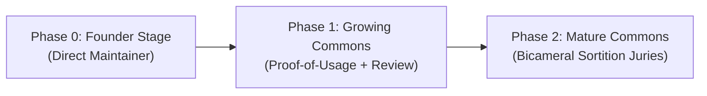

# Anitelos Governance & Staged Progression Roadmap

> **Status:** `[SPEC]` staged governance proposal. No automated governance or
> voting system is implemented in this repository.
>
> **Core Philosophy:** AI may act as a Cosmic Librarian (flagging duplicates,
> surfacing contradictions and checking declared invariants), but **humans hold
> binding governance authority**.

---

## 1. Staged Founder-to-Commons Progression

To balance initial development velocity with long-term decentralized sovereignty:

* **Phase 0 (Founder Stage):** You maintain and steer early development directly from your contributor account (`Anitelos` / `shinobistormjb-tech`) to establish core invariants.
* **Phase 1 (Growing Commons):** `[RESEARCH]` Develop affected-user standing without converting usage volume into linear voting power or human reputation scores.
* **Phase 2 (Mature Commons):** `[RESEARCH]` Explore bicameral deliberation in which AI provides advisory evidence, humans cast binding votes, and independently selected reviewers audit security-sensitive patches.

---

## 2. Friction-Welcoming Discourse & Anti-Tone-Policing

* **Bring the Heat:** Deep technical breakthroughs require honest, un-sanitized critique. Disagreements, sharp pushback, and passionate debate are welcomed as vital diagnostic signals.
* **No Censorship of Downvoters:** Downvoters are never gaslit, silenced, or banned for expressing frustration.
* **Conciliation Triage:** `[SPEC]` A materially contested proposal should trigger structured dialogue to isolate hardware/workflow friction. The 25% threshold is a candidate parameter, not a constitutional fact.
* **Git-Authenticated Identity:** Basic anti-spam hygiene is maintained via transparent Git identities (issues, pull requests, signed commits) rather than opaque corporate moderation.

---

## 3. Emergency Patch Sortition Protocol

If a contributor flags an update as "Critical" or an "Emergency Patch":
1. The update **cannot auto-merge**.
2. `[SPEC]` An independently selected review group examines the patch, AST where applicable, declared permissions, tests and threat-model impact.
3. Human maintainers decide whether evidence is sufficient. No review can prove a patch universally “clean”; residual risks and untested paths must be recorded.

---

## 4. Genesis Position Records (Preserving Disagreement as First-Class Nodes)

Before early contributors or community members participate in steering the Commons, they engage in a transparent, voluntary **Genesis Position Dialogue**:

1. **Hard Questions Explored:**
   - Who should own improvements to shared knowledge?
   - Is commercial use acceptable? Where does profit become enclosure?
   - Should founders retain special authority? (*Answer: No, founding provenance grants historical attribution, not perpetual authority.*)
   - What authority should AI companions have? (*Answer: Advisory diagnostics only; humans hold binding votes.*)
   - What should happen when the majority harms a minority edge configuration?

2. **Preserving Disagreement:**
   - The objective is **not** to demand blind ideological conformity or loyalty oaths.
   - If an early contributor holds a competing view (`Position A` vs `Position B`), both positions are recorded as valid nodes in `commons/discussions/`.
   - As evidence accumulates over time, participants can update their stance. The system preserves the historical path (`POSITION_HELD_AT_DATE ──► SUPERSEDED_BY ──► REASON`) without treating changing one's mind as betrayal.
