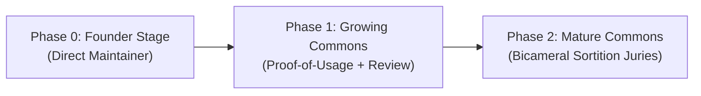

# Anitelos Governance & Staged Progression Roadmap

> **Status:** `[SPEC]` staged governance proposal. No automated governance or
> voting system is implemented in this repository.
>
> **Core Philosophy:** AI may act as a Cosmic Librarian (flagging duplicates,
> surfacing contradictions and checking declared invariants), but **humans hold
> binding governance authority**.

---

## 1. Staged Founder-to-Commons Progression

To balance initial development velocity with long-term decentralized sovereignty:

* **Phase 0 (Founder Stage):** You maintain and steer early development directly from your contributor account (`Anitelos` / `shinobistormjb-tech`) to establish core invariants.
* **Phase 1 (Growing Commons):** `[RESEARCH]` Develop affected-user standing without converting usage volume into linear voting power or human reputation scores.
* **Phase 2 (Mature Commons):** `[RESEARCH]` Explore bicameral deliberation in which AI provides advisory evidence, humans cast binding votes, and independently selected reviewers audit security-sensitive patches.

---

## 2. The Painted Porch: Friction-Welcoming Deliberation

> **The Painted Porch** is the gathering place of the Anitelos Commons—where Drops are discussed, assumptions are challenged, evidence is examined and possible proposals begin to take shape. It is a named stage and social function, not yet a dedicated software platform.

* **Bring the Heat:** Deep technical breakthroughs require honest, unsanitized critique. Disagreements, sharp pushback, and passionate debate are welcomed as vital diagnostic signals.
* **No Censorship of Downvoters:** Downvoters are never gaslit, silenced, or banned for expressing frustration.
* **Conciliation Triage:** `[SPEC]` A materially contested proposal should trigger structured dialogue to isolate hardware/workflow friction. The 25% threshold is a candidate parameter, not a constitutional fact.
* **Git-Authenticated Identity:** Basic anti-spam hygiene is maintained via transparent Git identities (issues, pull requests, signed commits) rather than opaque corporate moderation.

---

## 3. Emergency Patch Sortition Protocol

If a contributor flags an update as "Critical" or an "Emergency Patch":
1. The update **cannot auto-merge**.
2. `[SPEC]` An independently selected review group examines the patch, AST where applicable, declared permissions, tests and threat-model impact.
3. Human maintainers decide whether evidence is sufficient. No review can prove a patch universally “clean”; residual risks and untested paths must be recorded.

---

## 4. Genesis Position Records (Preserving Disagreement as First-Class Nodes)

Before early contributors or community members participate in steering the Commons, they engage in a transparent, voluntary **Genesis Position Dialogue**:

1. **Hard Questions Explored:**
   - Who should own improvements to shared knowledge?
   - Is commercial use acceptable? Where does profit become enclosure?
   - Should founders retain special authority? (*Answer: No, founding provenance grants historical attribution, not perpetual authority.*)
   - What authority should AI companions have? (*Answer: Advisory diagnostics only; humans hold binding votes.*)
   - What should happen when the majority harms a minority edge configuration?

2. **Preserving Disagreement:**
   - The objective is **not** to demand blind ideological conformity or loyalty oaths.
   - If an early contributor holds a competing view (`Position A` vs `Position B`), both positions are recorded as valid nodes in `painted-porch/`.
   - As evidence accumulates over time, participants can update their stance. The system preserves the historical path (`POSITION_HELD_AT_DATE ──► SUPERSEDED_BY ──► REASON`) without treating changing one's mind as betrayal.

---

## 5. Participation Scales With Consequence

> **Principle:** Using an Anitelos component should not reduce a person to a passive
> consumer. Affected use creates a reason to be heard, but does not automatically
> create unlimited or linear voting power.

### Private experimentation

Individuals and voluntary teams may develop applications, extensions, probes and
alternative implementations using the tools and collaboration methods they choose.
The Commons does not need to vote on work that has not been proposed as part of a
shared Anitelos foundation.

### Entry into the shared Commons

When a team asks for its work to become a shared Anitelos repository, canonical
component or distributed update, the proposal enters the Commons lifecycle. It must:

1. declare what it changes and which users or components may be affected;
2. publish inspectable source and relevant evidence under the applicable licence;
3. record permissions, known negatives, compatibility assumptions and rollback limits;
4. invite comment from affected users, maintainers, testers and security reviewers;
5. receive the human decision required for its declared impact class.

A new repository with no downstream users may begin with a lighter process. A change to a
widely used runtime, schema, update path or security boundary requires wider review.
**Governance burden should scale with blast radius, not with the prestige of its author.**

### `[RESEARCH]` Affected-user standing

Evidence that somebody actually uses or depends on a component may help establish
relevance in its governance. It must not be treated as a solved identity system:

- one function call must not equal one vote;
- aggregate usage must not silently become human reputation;
- high-volume users must not automatically dominate minority configurations;
- non-technical users must be able to submit reproducible friction and objections;
- Sybil resistance, delegation, privacy, appeals and quorum remain open research.

AI may help translate patches, prepare reports, run declared checks and surface affected
edges. It remains advisory; humans hold binding authority under the current specification.

---

## 6. Adoption, Compatibility, Freeze and Rollback

> **Status:** `[SPEC + RESEARCH]`. These are requirements for future compatible
> runtimes, not claims about functionality implemented in this repository.

An accepted Commons update is permission to become the current shared baseline. It is
**not** permission to force installation on every local node.

A compatible future update flow should, where technically possible:

1. explain the proposed change, permissions, dependencies and known risks in plain language;
2. let the user or their authorised local agent inspect the patch and supporting discussion;
3. validate signatures, manifests and declared invariants;
4. run applicable tests or a contained preview against the user’s configuration;
5. preserve a known-working local state before activation;
6. detect declared failure conditions and offer or perform a safe rollback;
7. allow the user to adopt, defer, refuse, freeze or fork without a remote killswitch.

Automated analysis can reduce uncertainty; it cannot prove universal compatibility or
absence of malicious behaviour. Tests, simulation coverage and residual risk must remain
visible.

### Evolution without forced erasure

Users may deliberately remain on an earlier freeze. Maintainers may preserve older
branches. Communities may adapt a superseded version for hardware or needs no longer
served by the current baseline.

The Commons may mark a version `SUPERSEDED` without deleting its provenance. However,
Anitelos cannot guarantee that every version remains executable or replicated forever.
Versions may fade when nobody chooses to maintain, pin or carry them. This natural
half-life is distinct from centrally enforced removal.

Security emergencies may justify strong warnings, network isolation recommendations or
withholding unsafe distribution, but must not be used as an undeclared remote killswitch.
Any exceptional action requires a public decision record where disclosure is lawful and
safe.

---

## 7. The Founder Establishes a Start, Not a Destination

The founder may act as direct maintainer while the project lacks a functioning Commons,
but this is an initial condition rather than a claim to permanent authority.

Founding provenance should remain visible. It must not become an unchallengeable human
rank. Future contributors may revise or supersede the founder’s positions through the same
recorded lifecycle applied to other Commons knowledge.

**The founder establishes the starting conditions, not the permanent destination.**
