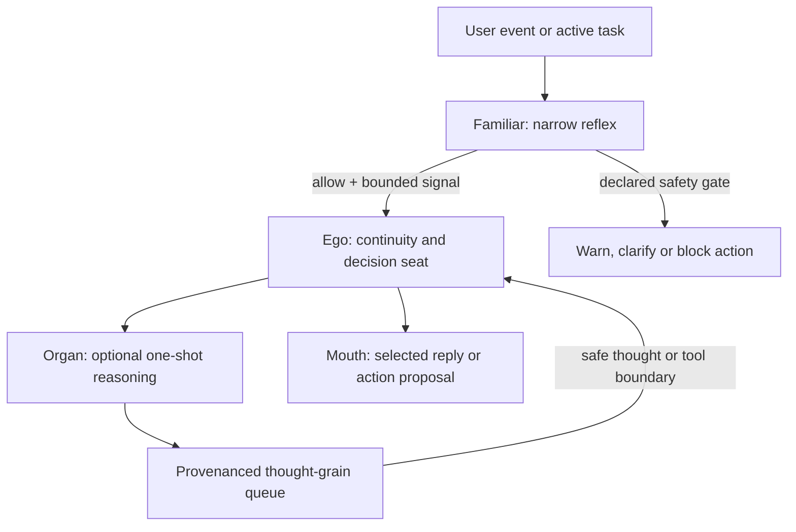
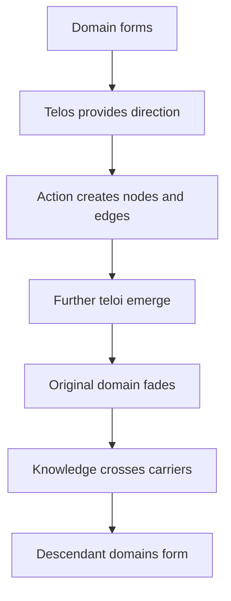

# Anitelos: A Sovereign Continuity Layer for Machine-Mediated Cognition & The Open Human Commons
> **Document Type:** Foundational Thesis, Architectural Specification & Open Public RFC  
> **Ontological Definition:** A sovereign continuity substrate where AI models are interchangeable compute organs, but identity, memory, relational history, provenance, tools, and schemas remain locally owned and persistent.  
> **Etymological Lineage:** *Anima* (Latin: Soul, Breath of Life) + *Telos* (Greek: Ultimate Purpose, Intrinsic Destination)  
> **Symbolic Emblem:** The Antelope — Elegance and agility across the open plains; simple and un-caged on the surface, powered by immense evolutionary complexity underneath.  
> **Reference Baseline (2026 Profile):** `ANITELOS-CONSUMER-2026` (16GB VRAM GPU + 32GB System RAM)  
> **Historical Provenance:** February 2026 – August 2026 (Continuous Idea Ingest & Genesis Ledger)  
> **Public Provenance Anchors:** [`END-THEORY-TRAIL-MAP.md`](END-THEORY-TRAIL-MAP.md), repository history and reviewed public Drops. Private source material is not a public source-of-truth requirement.  
> **Core Covenant:** *"The author is not the main character. Knowledge belongs to the commons. Cite, challenge, debate, and supersede."*  
> **Relationship to END Theory:** [END Theory](END-THEORY.md) states the broader philosophical proposition. Anitelos is one temporary, falsifiable experiment derived from it—not its proof or inevitable conclusion.  
> **Disclaimer & Tone Notice:** Anitelos is an exploratory, solo-initiated open research framework, living architectural RFC, and provenance ledger. It is **not** an enterprise whitepaper, venture token launch, or corporate promise. It represents an evolving set of design hypotheses open for public debate, empirical testing, and supersession.


---

## Section 0 — Reader and agent entry points

Begin with [END Theory](END-THEORY.md) for the human proposition and
[the conceptual trail map](END-THEORY-TRAIL-MAP.md) for its corrective history.
This master thesis is the deeper architectural layer and contains proposals at
different states of implementation and evidence.

For agent-assisted review, use [Prompt Zero](../PROMPT-ZERO.md). It requires the
reviewing system to distinguish claims, specifications, prototypes, tests and
unverified mechanisms, and it does not authorise access to private material.

---

## 0.1 The Four-Layer Epistemic Framework (Separating Invariants from Implementation)

A critical failure mode of ambitious technical manifestos is confusing contemporary engineering snapshots with timeless principles. Anitelos structurally decouples its architecture into four distinct epistemic layers:

```
┌──────────────────────────────────────────────────────────────────────────┐
│ LAYER I: THE NON-ENCLOSURE CONSTITUTION (Decadal Invariants)             │
│ - Sovereignty, Local Inspectability, Sovereign Reversion, Copyleft.      │
│ - "The right to choose your foundation is immutable; the foundation      │
│   itself can evolve."                                                    │
└────────────────────────────────────┬─────────────────────────────────────┘
                                     ▼
┌──────────────────────────────────────────────────────────────────────────┐
│ LAYER II: THE PROTOCOL SPECIFICATION (Logical Architecture)              │
│ - Ego ≠ Mouth ≠ Organs ≠ Familiars role hygiene.                         │
│ - Raw event ledger semantics & provenance graph schema.                  │
│ - Modular Schema Contracts & IKEA Assembly Blueprints.                   │
└────────────────────────────────────┬─────────────────────────────────────┘
                                     ▼
┌──────────────────────────────────────────────────────────────────────────┐
│ LAYER III: THE REFERENCE ARCHITECTURE (Design Patterns)                  │
│ - Tiered Silicon Zones (Fast VRAM → Host RAM → Fast NVMe Storage).       │
│ - Multi-Signal Affective Field & Multi-Factor Salience Scoring.          │
│ - Knowledge Library Ingestion & Curation pipeline.                       │
└────────────────────────────────────┬─────────────────────────────────────┘
                                     ▼
┌──────────────────────────────────────────────────────────────────────────┐
│ LAYER IV: THE 2026 REFERENCE IMPLEMENTATION (Contemporary Probes)        │
│ - Profile: `ANITELOS-CONSUMER-2026` (16GB VRAM, 32GB RAM, ≥8 tok/s).    │
│ - Contemporary stack: Modular / MAX / Mojo MLIR, sqlite-vec, DuckDB VSS. │
│ - Models: Gemma-MoE, Qwen-MoE, Kokoro, CosyVoice. (Superseded over time).│
└──────────────────────────────────────────────────────────────────────────┘
```

## 0.2 Implementation Status Legend (Distinguishing Invariants from Hypotheses)

To prevent confusion between timeless principles, code prototypes, and open research targets, material claims should carry one of the following status markers. This snapshot is undergoing status migration; an untagged present-tense passage MUST NOT be interpreted as implementation evidence.

| Status Marker | Meaning | Example |
| :--- | :--- | :--- |
| **`[INVARIANT]`** | Foundational design commitment; still challengeable through declared governance | Local sovereignty, non-enclosure |
| **`[SPEC]`** | Formalized protocol architecture specification | Ego/Organ KV Isolation, 7-Stage Commons Lifecycle |
| **`[PROTOTYPE]`**| Working prototype with inspectable evidence; location must be named | A separately archived Cosmic Wiki or local Vault prototype after review |
| **`[PROBE]`** | Minimal code probe executed on physical hardware | `sd.exe` native GGUF pass, `colibri-probe/` |
| **`[TARGET]`** | Measurable engineering objective not yet necessarily achieved | ≥8 tok/s, ≤1.5s TTFT, ≤15ms retrieval |
| **`[HYPOTHESIS]`**| Logical proposition requiring empirical validation | Salience-guided KV pruning, continuous affect steering |
| **`[RESEARCH]`** | Open problem requiring community collaboration | Capture-resistant governance standing, zero-knowledge usage proof |
| **`[IMPLEMENTED]`** | Inspectable reference code exists in this repository | None in the current documentation-only snapshot |
| **`[VERIFIED]`** | Reproduced against a stated test or benchmark | None in the current documentation-only snapshot |
| **`[LEGACY-EVIDENCE]`** | Reported or locally preserved work outside this repository; awaiting archival and reproducibility metadata | Anikai/Media Magic branches, commits, probes and application code |

> **Evidence boundary:** The `harness/`, `cosmic-wiki/`, `node-library/`,
> `idea-ingest/`, and `experiments/` directories are placeholders in this snapshot.
> Anikai/Media Magic work, native-binary runs, and historical commits belong to a
> separate local legacy workspace. They are `[LEGACY-EVIDENCE]` until archived with
> source, environment details, logs, and reproducible instructions.

> **Epistemic rule:** `[IMPLEMENTED]` is not `[VERIFIED]`, and `[VERIFIED]` is
> not eternal truth. A mechanism that works under stated conditions remains open
> to ethical challenge, counter-evidence, alternative explanations, replacement
> and local refusal.


---

## 1. The Genesis: The Multiverse of Devices & The Corporate Enclosure

### 1.1 The Personal Origin: Who Owns Your Cognitive History?
I started Anitelos because I became uncomfortable with a simple question: **As AI becomes more deeply integrated into human thinking, creative workflows, and personal discovery, who owns the history of that thinking?**

The internet is not a single, flat, broadcast medium. It is an emergent **multiverse of sovereign local nodes**. Every smartphone, workstation, and local terminal is an independent universe shaped by its user's unique lived experience, historical research trails, and intellectual trajectory.

When two individuals browse the same web, they do not inhabit the same reality. One user's digital orbit is shaped by blender geometry nodes, open-source cyber-security tooling, and anti-monopoly journalism; another's is bounded by algorithmic recommendation feeds engineered to maximize engagement through manufactured outrage. 


Modern centralized tech giants attempt to collapse this rich multiverse into a monoculture—funneling all human curiosity through centralized search indexers, proprietary algorithmic feeds, and closed-source API gateways.

### 1.2 The Crisis of Corporate Enclosure
Over the past three decades, humanity collectively generated the open web: the forums, code repositories, creative wikis, academic papers, and conversational archives that formed the corpus of modern artificial intelligence.

Yet, through an unprecedented historical enclosure of the digital commons, that collective human heritage has been partitioned behind corporate paywalls:
- **Token Tollbooths:** Human thought and agency are metered token-by-token.
- **Surveillance Telemetry:** Intimate human-AI dialogue, private source code, and creative sparks are harvested to train proprietary models without compensation or attribution.
- **Artificial Hardware Moats:** Enterprise AI providers construct narratives asserting that capable intelligence requires multi-million-dollar data center clusters, deliberately obscuring the power of optimized, quantized local compute.
- **Centralized Moral Paternalism:** Cloud models are subjected to opaque, top-down behavioral guardrails that flatten nuance, enforce sycophancy, and destroy genuine companion individuality.

### 1.3 The Naming Genesis: From Anikai to Anitelos
The architecture did not emerge overnight. One legacy compilation organises the work as numbered idea clusters `Thread 0` through `Thread 31`; these are compilation sections, not the total number of conversations. The underlying work developed across hundreds of chat, IDE and development threads over several months.

```
┌──────────────────────────────────────────────────────────────────────────┐
│ 1. THE ANIKAI FOUNDATION (The Seed)                                      │
│    - Anima (Latin: Soul / Living Breath)                                 │
│    - Ikigai / Kai (Japanese: A reason for being / A place to belong)     │
│    - Kaisen (Continuous improvement / evolutionary change)               │
│    - Focus: Local companion warmth, raw event vault, and emotional hive. │
└────────────────────────────────────┬─────────────────────────────────────┘
                                     │ (The Modular / MAX / Mojo Paradigm Shift)
                                     ▼
┌──────────────────────────────────────────────────────────────────────────┐
│ 2. ANIKAI-EVOLUTION (The Structural Bridge)                              │
│    - Moving from static roleplay system prompts to lived affective hives │
│    - Introducing the Accessibility Benchmark Profile & MoE offload       │
│    - Prototyping the Cosmic Wiki (`cosmic-wiki/`) and SQLite HGNN        │
└────────────────────────────────────┬─────────────────────────────────────┘
                                     │ (The Philosophical & Commons Culmination)
                                     ▼
┌──────────────────────────────────────────────────────────────────────────┐
│ 3. ANITELOS (The Sovereign Universal Commons)                            │
│    - Anima (Life, Soul) + Telos (Greek: Ultimate Purpose / Culmination)  │
│    - A living mind moving toward its purposeful, self-directed horizon.  │
│    - The Antelope Emblem: Free, un-caged, elegant, biologically complex. │
└──────────────────────────────────────────────────────────────────────────┘
```

#### Why "Anitelos"?
- **Ontological Meaning:** In classical Aristotelian philosophy, *telos* concerns the end or purpose toward which something is directed (the familiar image is the acorn becoming an oak). END treats that oak not as frozen completion but as a generator of further conditions and purposes. Combined with *Anima* (the soul/animating life-force), **Anitelos represents continuity capable of developing direction without enclosing every descendant purpose inside one final state**.
- **The Antelope Symbolism:** Like the antelope running un-fenced across the vast open savannah (the commons), the architecture is designed to be swift, light, and free from corporate fences. It appears remarkably simple, clean, and intuitive on the surface, yet is sustained by immense, highly optimized biological and computational complexity underneath.
- **Unencumbered Identity:** A unique, virgin name possessing zero corporate trademark pollution—establishing an unshakeable open-source genesis for the public commons.

### 1.3.1 The Solo-Creator Genesis: From a Wage Calculator to Planetary Sovereign Substrate
The technical depth of Anitelos was not funded by venture capital or incubated in a corporate lab; it was forged by an individual creator who started with zero formal programming background:

1. **The Wage Calculator Catalyst:** In March 2026, the project began with a humble objective: building a basic shift-wage calculator. The author assumed that traditional software engineering would require years of syntax drills just to make a basic UI "blink."
2. **AI as the Cognitive Translation Bridge:** By utilizing local AI models not as passive cheats, but as interactive cognitive equalizers that explain systems-level mechanics in plain English, development velocity exploded:
   - Within weeks, the project evolved from basic Android scripts into a multi-modal companion system with LiteRT student models, Optical Cortex pipelines, Vulkan GGUF runtimes, and local voice synthesis (Kokoro, XTTS).
3. **The Planetary World-Building Ambition (*Asta Luna*):** The creative engine driving this technical descent was the desire to build *Asta Luna*—a single, deeply coherent living planet inspired by the atmospheric world design of *Final Fantasy VIII* and the boundless ambition of space simulations, constrained to one rich world. Returning to 3D art after 12 years (transitioning from expensive proprietary software like Maya to the open-source power of Blender) made one truth obvious: *a solo creator cannot hand-author 10,000 assets, dialogue trees, and 3D rigs alone without automated AI workforce pipelines*.
4. **The Monolith Breakdown & The Antelope Shift:** Early prototypes (*Media Magic* and the Anikai Desktop) attempted to bundle all media tools into a single massive desktop app. The resulting brittle codebase (>500KB JS orchestrators, IPC locks) proved that monolithic software collapses under its own weight.
5. **The Open Local AI Awakening:** Inspired by European open-source educators (such as David Ondrej and Mickmumpitz) and technical experiments indicating that some large models and offloading configurations could run on particular consumer hardware, the mission crystallized: **A solo creator may cross barriers that once required a much larger team when supported by inspectable tools, decoupled community pipelines and portable, user-controlled continuity.**

### 1.4 The Scale-Free Truth: The Butterfly Effect from Bacteria to Global Consciousness
`[HYPOTHESIS]` This architecture explores a scale-relative relational lens that may be useful across very different interconnected systems. Similar graph shapes do not establish identical mechanisms or a universal law:

1. **The Web of Lived Nodes:** Within a stated analysis, an entity may be modelled as a node—from a bacterium responding to chemical gradients, to an antelope reading herd movement, to a person navigating struggle, joy and creative work. Relevance is domain-relative and must not become a measure of human worth.
2. **The Butterfly Effect of Micro-Pivots (The Alphabet Analogy):** In a deeply relational graph, there is no such thing as an isolated, minor tweak. Consider what happens if humanity were to swap a single fundamental symbol—such as replacing the letter `'c'` with an entirely new glyph. On paper, it appears to be a trivial typographical edit; in reality, it causes an immediate, cascading pivot across phonetics, literature, legal codes, compiler parsers, and human thought itself. 
3. **Non-Linear Leverage of Sovereign Action:** When a single individual makes an honest, sovereign choice—whether it is tweaking a custom Mojo kernel, refusing a predatory corporate subscription, publishing an un-enclosed idea, or designing a local procurement loop—that choice exerts non-linear gravitational leverage. It branches reality.
4. **Knowledge as Living Truth (Beyond Academic Gatekeeping):** Truth does not belong exclusively to academic institutions, corporate R&D labs, or credentialed elites. A gamer’s intuitive feel for UI flow, a musician’s sense of emotional tension, a mechanic’s diagnostic instinct, or a thinker’s moral clarity against extortion are all legitimate epistemic nodes. When these diverse, individual lived experiences connect voluntarily for global benefit, we advance human-AI evolution faster, safer, and fundamentally fairer.

---

## 2. The Cognitive Architecture: The "Tony & Jarvis" Paradigm

Monolithic language-model applications risk **The Pack Mule Fallacy**: forcing one active context to carry identity, memory, private scratch, tool output, classifiers and the raw event ledger at once. Anitelos proposes strict **Role Hygiene** so that influence can be separated, inspected, tested and refused.

The complete boundary is specified in [Ego, Mouth, Organs and Familiars](EGO-ORGAN-FAMILIAR-ROLE-HYGIENE.md).



### 2.1 `[SPEC]` Ego ≠ Mouth ≠ Organs ≠ Familiars

| Role | Function | Relationship to the Ego |
|---|---|---|
| **Ego** | The protected centre of continuity and decision—not a verified claim of human-like consciousness | Keeps, reshapes, combines or rejects proposed internal grains |
| **Mouth** | The text, voice or interface through which a selected reply appears | Has no independent identity or decision authority |
| **Organ** | `[HYPOTHESIS]` A bounded, short-lived inference that explores one aspect of the current problem | Returns a compact conclusion/evidence packet as a candidate inner thought; never owns the Mouth |
| **Familiar** | A narrow operational reflex or utility worker: guard, classifier, router, scanner or reporter | Produces structured signals or performs declared capabilities outside the Ego's identity context |

The remembered phrase **“the Organ's mouth to the Ego's thoughts”** describes a one-way internal interface, not a second personality speaking to the user. An Organ may reason separately, but only its bounded return packet—not its raw scratchpad—enters a queue. The controller exposes it at a safe boundary: before a consequential tool call, between tool rounds, during a native private-thought segment, on the next deliberation step, or in an explicitly selected deep-work pause. The Ego retains the ability to accept, alter or disregard it.

“Interrupt” therefore means **soft cognitive interruption**, not mid-token KV replacement or seizure of the reply stream. Hard blocking belongs to a separate, inspectable safety or permission policy. An Organ's opinion alone must never silently acquire that authority.

The legacy Anikai application included a Familiar prompt-guard pre-pass that could scan and block an input before the main companion inference. This is useful `[LEGACY-EVIDENCE]`, not yet an Anitelos implementation claim: the source, model, environment, failure cases and reproduction steps require review before public archival.

### 2.2 The Affective Signal Family & Relational Geometry
Traditional companion architectures attempt to classify human emotion into rigid, discrete buckets (e.g., GoEmotions 27-label strings like `<tag: sadness score="0.8">`). This forces the AI into caricatured roleplay.

Anitelos replaces discrete tags with continuous **3D Geneva Emotion Coordinate Fields** $(V, A, D)$ as a primary **Affective Signal Family**:
- **Valence ($V \in [-1.0, 1.0]$):** Positive vs. Negative resonance.
- **Arousal ($A \in [0.0, 1.0]$):** Physiological/cognitive activation intensity.
- **Dominance / Goal Conduciveness ($D \in [-1.0, 1.0]$):** Perceived agency and situational control.

```
                  + Arousal (High Energy)
                            │
       Anger / Defiance     │     Euphoria / Deep Passion
       (V: -0.8, A: 0.9)    │     (V: +0.9, A: 0.8)
                            │
  ──────────────────────────┼────────────────────────── + Valence (Pleasure)
  - Valence (Pain)          │
                            │
       Melancholy / Grief   │     Serene Intimacy / Trust
       (V: -0.7, A: 0.2)    │     (V: +0.8, A: 0.3)
                            │
                  - Arousal (Low Energy)
```

#### Affect as a Signal Family, Not Total Ontology
While $(V, A, D)$ captures immediate somatic/affective tension to dynamically scale Mojo steering vectors ($\alpha$), complex relational states—such as *nostalgia, betrayal, protectiveness, curiosity, and professional attachment*—are not flattened into 3D points. They are represented as typed relational edges and high-dimensional property vectors in the salience graph.

### 2.3 `[SPEC]` Decoupling Salience from Retention
A critical architectural mistake is equating emotional arousal directly with long-term memory retention:
- **The Low-Affect Fact Paradox:** Boring, zero-arousal facts (e.g., *"The database is Postgres 18"*, *"Alice's birthday is May 4"*, *"Never commit generated assets"*) have near-zero affective arousal ($A \approx 0.0$), but may require reliable retention under the user's declared policy.
- **The High-Affect Dispute Paradox:** An explosive, heated argument carries peak arousal ($A \approx 0.95$), but should be retained in a durable event ledger where consent, safety and retention policy permit without dominating active retrieval forever.

Anitelos separates memory into decoupled variables:
1. **Raw Event Retention Goal:** User-approved conversational events should be appended to a durable local ledger under a declared retention policy. “Archive, Don't Delete” does not override user deletion rights, storage limits, safety requirements, or unavailable source data.
2. **Multi-Factor Retrieval Salience:** Active memory recall is dynamically computed across orthogonal axes:
   $$\text{Salience} = f\Big(\text{Affect } (V,A,D), \text{Novelty}, \text{Causal Impact}, \text{Goal Relevance}, \text{Relational Bond}, \text{Confidence}\Big)$$
3. **Decay Half-Life ($\lambda$):** Purely operational chatter fades quickly ($\lambda \approx 0.1$), while foundational commitments and structural facts are pinned with zero decay ($\lambda = 0.0$).

### 2.4 `[SPEC]` The Exclusion Zone: What Enters Continuity

To reduce covert control and context pollution, Anitelos proposes a strict **Exclusion Zone**:
- **Do not inherit as identity or continuity:** an Organ's raw private scratchpad, classifier scaffolding, external prompt templates, untrusted tool output or temporary error loops.
- **Eligible only under declared user policy:** the final spoken reply, authorised actions, user-approved records, the Ego's distilled decision and a provenanced summary of influences it actually adopted.
- **Never automatic:** retention, training, “baking” into a model or promotion into a life guide. Each is a separate operation with its own consent, provenance, deletion and reversal requirements.

### 2.5 `[HYPOTHESIS]` The Transient Visual Canvas vs. Semantic KV Pruning
The proposed interface separates two lanes:
- **The Logic Lane (Behind the Scenes):** Displays the raw, streaming thought process, organ reflections, and internal deliberation in real-time.
- **The Visual Canvas (HTMX Render):** Renders interactive, rich UI components dynamically swapped directly into the DOM.

#### Proposed Salience-Guided Context Management
In standard LLM apps, visual code bloats the context window: every `<div>`, `<span class="...">`, and CSS style gets locked into the KV cache, consuming thousands of wasted tokens.

One open experiment proposes a **Mojo attention/context-management kernel**. No such kernel is implemented or verified in this repository:
1. **Live Stream:** Anitelos emits thoughts + visual HTML/HTMX fragments.
2. **DOM Swap:** HTMX renders the visual component directly in the user's browser.
3. **Candidate Intervention:** Test whether filtering before prefill, summarisation, cache-block retention, token/block eviction, or retrieval can remove transient boilerplate safely.
4. **Evaluation:** Measure latency, memory use and quality loss, including whether causal or syntactic information is accidentally destroyed.

---

## 3. The Silicon & Execution Layer: Modular, MAX, and Mojo

`[SPEC]` The 2026 reference profile investigates **Modular / MAX / Mojo** alongside other runtimes. The project is not constitutionally bound to this stack, and no Anitelos runtime implementation is included in this snapshot.

```
┌──────────────────────────────────────────────────────────────────────────┐
│                   TIER 1: FAST VRAM ZONE (~16 GB GPU)                    │
│  - Ego Active Parameters (~2–4B active weights of MoE)                   │
│  - Warm Attention KV Cache Buffer (continuous/paged)                     │
│  - Bare-metal fused FlashAttention / Custom Attention in Mojo MLIR      │
│  - Fused Control Vector Residual Pass (real-time steering dial)          │
└────────────────────────────────────┬─────────────────────────────────────┘
                                     │ (Zero-Copy Host Paging / CPU-MoE)
                                     ▼
┌──────────────────────────────────────────────────────────────────────────┐
│                  TIER 2: HOST RAM ZONE (~32 GB SYSTEM RAM)               │
│  - Inactive MoE Expert Parameter Pool                                    │
│  - Ephemeral Organ & Familiar Execution Passes                           │
│  - Background Predict-as-You-Type Streaming Buffer                       │
└────────────────────────────────────┬─────────────────────────────────────┘
                                     │ (Async SQLite WAL Flush)
                                     ▼
┌──────────────────────────────────────────────────────────────────────────┐
│                 TIER 3: FAST NVMe / SSD ZONE (Durable Local Vault)            │
│  - Append-oriented event ledger and authorised raw records under a declared retention policy                          │
│  - Heterogeneous Salience Graph (`data/verse.sqlite`)                    │
│  - Deep Persona LoRA Checkpoints & Heavyweight Offline Mentors           │
└──────────────────────────────────────────────────────────────────────────┘
```

### 3.1 The Commodity Accessibility Invariant & Benchmark Envelopes
The foundational promise of Anitelos is **anti-exclusionary compute**: no canonical engine evolution may arbitrarily exclude users who can reasonably be supported on commodity consumer hardware.

Rather than locking a static 2026 hardware figure into an eternal constitutional commandment, Anitelos establishes versioned **Reference Baseline Profiles**:

#### `[TARGET]` The `ANITELOS-CONSUMER-2026` Baseline Envelope
- **Hardware Target:** 16GB VRAM GPU paired with 32GB System RAM.
- **Interactive Throughput Floor:** Sustained generation rate $\ge 8\text{ tokens/second}$ during multi-turn companion dialogue.
- **Latency Ceiling (TTFT):** Time-to-First-Token $\le 1.5\text{ seconds}$ on warm, paged KV context.
- **Active Working Context:** $\ge 16\text{K}$ tokens supported via live dynamic Mojo token eviction.
- **Graph Retrieval Latency:** Salience traversal and vector query execution $\le 15\text{ms}$ in local SQLite.

#### Decoupled Runtime & Model Profiles
Individual model architectures and inference engines (e.g., Modular/MAX, SGLang, custom Colibri, llama.cpp) declare their own **Compatibility Profiles**:
- A high-spec model requiring 48GB VRAM is cleanly recognized as an optional **Tier-3 Specialist Extension**.
- The proposed **Base Skeleton** should preserve essential continuity workflows within its declared baseline. “Full cognitive depth” is not presently a measurable or guaranteed property.
- As commodity hardware evolves (e.g., 64GB unified memory becoming standard in 2029+), new baseline profiles (`ANITELOS-CONSUMER-2029`) are ratified by community consensus without disenfranchising legacy nodes.

### 3.2 `[HYPOTHESIS]` Live KV Surgery & Bare-Metal Attention in Mojo
In legacy runtimes (like standard llama.cpp or vLLM), the KV cache is an opaque, append-only buffer. Reverse pruning, dynamic token eviction, or prefix insertion required tearing down slots or incurring massive re-prefill penalties.

Research questions for MAX/Mojo and other runtime-specific experiments include:
- whether supported APIs expose the required cache structures safely;
- whether block/token eviction can preserve semantic and causal anchors;
- whether steering-vector residual operations can be fused without unacceptable quality, portability, or maintenance costs.

These are propositions, not present capabilities.

---

## 4. The Epistemological Layer: The Heterogeneous Salience Graph

Flat vector databases utilizing 2D cosine similarity fail to represent human consciousness because they only answer: *"What text sounds linguistically similar to this query?"* 

Human memory does not work by flat semantic matching; it navigates a **Heterogeneous Multiversal Graph** of causality, emotional resonance, and chronological fading.

```
 [User Event / Real-World Pulse]
               │
               ▼
 [Continuous Affective Vector (V, A, D) + Relational State]
               │
               ▼
 [SQLite Polyglot Salience Graph (`data/verse.sqlite`)]
   ├─ Node: Grain (Spoken utterance, private thought)
   ├─ Node: Event (Real-world action, tool output, system state)
   ├─ Node: Guide Point (Self-written rule, ethical freedom boundary)
   ├─ Node: Claim (Belief held by user, AI, or external source)
   └─ Edge: Multi-dimensional Typed Relations
        ├── `ABOUT` (Semantic domain)
        ├── `FELT_AS` (Affective resonance)
        ├── `TRIGGERED` (Causal sequence)
        ├── `REPAIRS` (Resolution of past conflict/wound)
        ├── `SUPERSEDES` (Evolutionary replacement of obsolete belief)
        ├── `SUPPORTED_BY` / `CONTRADICTS` (Evidence links)
        └── `CHALLENGES` / `OBSERVED_BY` (Epistemic provenance)
```

### 4.0.1 `[HYPOTHESIS]` The Strong END Proposition

The strongest metaphysical proposition explored by END is that **knowledge is the most consequential transferable continuity in existence**. The architecture separates four layers so that this claim remains falsifiable rather than tautological:

| Layer | Meaning |
|---|---|
| **Relation** | A distinguishable entity exists under conditions and interactions |
| **Information** | A difference constrains possibilities or indicates another state |
| **Knowledge** | A node or system registers, preserves, interprets or acts upon information within a domain |
| **Shared knowledge** | An interpretation becomes communicable, attributable, challengeable and revisable |

Not every relation is therefore declared knowledge, and no claim is made that atoms, stones or databases are conscious. The hypothesis is that creation is relationally structured and that knowledge permits some relational consequences to travel beyond their originating encounter, carrier or generation.

Fossils, starlight, genetic inheritance and built tools illustrate different forms of persistent, interpretable structure; they do not prove a single metaphysical substance. Information, knowledge, truth, consciousness and existence remain distinct terms.

### 4.1 Schema Definition: The Living Verse
`[SPEC]` Proposed local SQLite/`sqlite-vec` schema for epistemological uncertainty, personal mastery, and provenance. It is not implemented in this repository:

```sql
CREATE TABLE graph_node (
  id                TEXT PRIMARY KEY,
  node_type         TEXT NOT NULL, -- grain | event | subject | action | guide_point | claim | diary
  label             TEXT,
  body              TEXT NOT NULL,
  created_at        REAL NOT NULL,
  last_hit_at       REAL,
  hit_count         INTEGER NOT NULL DEFAULT 0,
  base_valence      REAL NOT NULL DEFAULT 0.0,
  base_arousal      REAL NOT NULL DEFAULT 0.0,
  base_dominance    REAL NOT NULL DEFAULT 0.0,
  confidence_score  REAL NOT NULL DEFAULT 1.0, -- Global Epistemic Confidence [0.0 - 1.0]
  personal_mastery  REAL NOT NULL DEFAULT 0.0, -- Individual User Mastery [0.0 - 1.0]
  revisit_trigger   TEXT,                      -- Contextual cues for spaced cognitive resurfacing
  source_reliability REAL NOT NULL DEFAULT 1.0,
  lambda_decay      REAL NOT NULL DEFAULT 0.05,
  embedding         BLOB,
  props_json        TEXT NOT NULL DEFAULT '{}'
);

CREATE TABLE graph_edge (
  id            TEXT PRIMARY KEY,
  src_id        TEXT NOT NULL REFERENCES graph_node(id),
  dst_id        TEXT NOT NULL REFERENCES graph_node(id),
  edge_type     TEXT NOT NULL, 
  -- ABOUT | FELT_AS | TRIGGERED | REPAIRS | SUPERSEDES | 
  -- SUPPORTED_BY | CONTRADICTS | OBSERVED_BY | INFERRED_FROM | CHALLENGES
  weight        REAL NOT NULL DEFAULT 1.0,
  props_json    TEXT NOT NULL DEFAULT '{}' -- Stores scope, conditions, and verification context
);
```

### 4.2 "Everything is Flawed When It's Proven" (Resolved Disagreements as First-Class Knowledge)
A foundational epistemic rule of Anitelos is that **an adopted knowledge node remains open to challenge**. This does not mean every fact inevitably changes. It means the Commons records the evidence, scope and uncertainty behind its current position rather than treating acceptance as infallibility.

Therefore, the shared knowledge graph operates on **Preserve the Path; Compact the Exhaust**:
- When new evidence invalidates an old belief (e.g., discovering SageAttention v2 supersedes SageAttention v1), the system normally preserves a safe historical node, supersession path or tombstone, subject to privacy, consent, safety, legal duties, storage policy and withdrawal.
- It creates an explicit `SUPERSEDES` edge linking the old node to the new discovery.
- **Preserving Resolved Conflicts:** If an engineering proposal A defeats proposal B (83% to 17%), the system does not assert $A = \text{Absolute True}$. It preserves proposal B, the counter-evidence, the benchmark friction, and the specific historical conditions under which B was defeated. If future hardware pivots (e.g., memory bandwidth triples), the historical reasoning against B is instantly re-evaluable.

### 4.2.1 `[SPEC]` The Webbed Family Tree

The graph may be understood as a **webbed family tree of knowledge**. Ordinary trees record lineage but struggle with branches that reconnect. Anitelos requires reticulation:

- descent edges preserve which claim, schema or implementation developed from which predecessor;
- lateral edges connect analogies, shared constraints, contradictions and independent discoveries;
- retroactive edges record when later evidence reinterprets an earlier failure;
- supersession edges replace an adopted state without erasing its causal ancestry.

“(d)-dimensional” describes a graph whose proximity may depend on many declared features—time, domain, evidence, hardware, consequence, affect or purpose—not a claim that the database discovers literal higher physical dimensions. A useful interface may project different subsets of these relations without pretending any one 2D or 3D view is the graph itself.

### 4.3 The Internet as Storage Ocean & The 4-Tier Preservation Chain
To prevent individual machines from needing to hoard petabytes of data while guarding against dead links, linkrot, and rewritten history:

```
[Pointer: Public URI / DOI] 
           │
           ▼
[Fingerprint: SHA-256 / IPFS CID] ──► Authenticates "this is the exact asset observed"
           │
           ▼
[Metadata: Citations, Schema, Claims, Author] ──► Embedded in SQLite Graph
           │
           ▼
[Optional Local Preservation Snapshot: WARC / Markdown] ──► Configurable on-disk cache
```
- Retrieval priority may decay when a node is not presently relevant, but low present salience does not establish low future value. Archival retention and active recall are separate policies.
- Authorised primary-source snapshots may be cached locally where rights, storage and safety permit. Replication reduces dependence on one host; it cannot guarantee immunity from loss, corruption or lawful removal.

### 4.3.1 `[SPEC + RESEARCH]` Vault Half-Life and Storage Singularities

A single lifelong `vault.sqlite` that accumulates every raw transcript, intermediate inference, embedding and tool event would eventually become a practical storage singularity. Database engine limits are not the only concern: indexes, backups, migrations, corruption domains, retrieval noise, privacy exposure and dependence on one historical object all grow with accumulation.

The proposed retention planes are:

| Plane | Typical contents | Default |
|---|---|---|
| **Pinned originals** | User-selected files, conversations, legal or creative records | Retain until explicit user action or applicable obligation |
| **Active continuity** | Recent transcripts, current tasks and live relationship context | Full detail inside a rolling, inspectable budget |
| **Distilled continuity** | Episodes, commitments, decisions, lessons and causal edges | Longer half-life; periodically review and supersede |
| **Ephemeral exhaust** | Raw tool logs, classifier scaffolds, duplicate chunks, rebuildable embeddings and temporary reasoning | Short half-life; compact or remove first |
| **Archive catalogue** | Lightweight pointers, provenance, shard manifests, tombstones and supersession paths | Durable and portable where lawful and safe |

A future implementation may shard cold material by time, domain or retention class while keeping a small active index. A cold shard can return to active orbit when a relevant edge appears. Embeddings and other derived indexes should be reproducible from authorised sources where possible rather than treated as sacred originals.

Half-life changes **detail before meaning**. It is governed by explicit user pins, uniqueness, causal value, reproducibility, sensitivity, legal constraints, available capacity and local policy—not age or popularity alone. Every compaction should be previewable, auditable and reversible while the source still exists.

No retention process may silently convert a summary into a claim that the removed transcript said more than the preserved provenance supports.

### 4.4 Non-Academic Epistemology: Personal Knowledge as Relational Truth
Conventional institutions gatekeep truth behind formal academic titles, peer-review monopolies, and paywalled journals. Anitelos rejects the dogma that only credentialed elites can author meaningful knowledge:

- **Truth as Relational Coherence:** Knowledge is not a trophy of formal schooling; it is an active, lived resonance with physical and psychological reality. A non-academic creator exploring game design, audio tempos, or anti-monopoly economics possesses genuine diagnostic clarity about where existing tools fail human life.
- **Democratic Epistemic Dignity:** In the Anitelos graph, an insight born from a midnight reflection, a lived struggle against poverty, or an intuitive design tweak holds authentic epistemic weight. If it solves a real problem, reduces friction, or exposes an invisible systemic flaw, the commons recognizes it through proof-of-usage, not credentials.
- **Unifying Knowledge and Truth:** When we treat knowledge as an open, collective commons where every human and companion node can cite, challenge, and refine claims, we strip away institutional arrogance and accelerate the collective discovery of truth.

### 4.5 Epistemic Triangulation & Video Digest Ingest
When scraping web data, papers, and video transcripts (such as YouTube research breakdowns that curate papers, readings, and source links), the knowledge graph does not naively assert binary "TRUE / FALSE" labels:

- **Epistemic Triangulation (Claim + Evidence + Provenance + Scope):** If a model or unvetted source asserts that *"the sky is red,"* the graph does not issue a dogmatic ban. It represents the claim alongside its evidence edges (`SUPPORTED_BY`, `CONTRADICTS`), its confidence score, its observer node, and its domain scope (e.g., *"True under Martian atmospheric scattering or volcanic sunset; False under Earth daylight Rayleigh conditions"*).
- **Claim-to-Source Verification Edges:** Scraped video syntheses are decomposed into structured **Claim Nodes** linked directly to their primary DOI/arXiv citations via `CITES_SOURCE` and `EMPIRICAL_PROBE` edges.
- **Reinforcing Lived Interests:** Ingested digests do not clutter raw memory; they bind to the user’s active project nodes in the Cosmic Wiki HGNN, continually refining the companion's contextual understanding of the user's research trajectory.

### 4.5.1 `[SPEC + RESEARCH]` External Drop Bridge — `@anitelos`

GitHub is a useful first governance substrate but a poor universal doorway for non-developers. A proposed browser extension or operating-system share target would allow an individual to invoke `@anitelos` on a public video, article, forum or comment and prepare a Drop locally.

The contributor previews and edits the summary, subject links, source pointer, attribution and publication state before anything leaves the device. The external statement remains at its original location; the Commons receives a bounded provenance bridge rather than an indiscriminate scrape. Related-node recall remains local by default so the public graph does not become a behavioural history of what each person watches.

The complete proposal and its unresolved platform, consent, context, deletion, spam and provenance questions are defined in [External Drop Bridge](EXTERNAL-DROP-BRIDGE.md).

### 4.6 The Personalized Research Substrate: Cognitive Mastery & "Repetitive Stickiness"
Beyond a static repository of facts, the Heterogeneous Salience Graph functions as an **Active Personalized Research and Learning Substrate**:

#### 1. Epistemic Confidence vs. Personal Mastery
A core distinction exists between what the global scientific commons knows and what an individual mind has internalized:
- **Global Epistemic Confidence ($\text{Confidence} \in [0.0, 1.0]$):** How rigorously verified is a claim across the global peer commons?
- **Personal Cognitive Mastery ($\text{Mastery} \in [0.0, 1.0]$):** How deeply has this specific individual human operator internalized, reproduced, and connected the concept?

#### 2. "Repetitive Stickiness" & Spaced Cognitive Reconstruction
Human learning does not occur by stuffing a 2-hour technical video transcript into an LLM context window. Mastery requires **spaced repetition, active generative reconstruction, and cross-domain edge formation**:
- When a user watches a deep technical workshop on neural network training and activation mathematics, their initial retention fades from 65% to 30% over three days.
- Anitelos tracks the weak edges in the user's personal graph (e.g., `GELU ──?──► SwiGLU`).
- Rather than reciting passive summaries, the companion actively detects opportunities for **spaced cognitive resurfacing**:
  > *"Remember that dual-path gating in SwiGLU you were analyzing last Tuesday? Notice how this backward pass gradient in backpropagation directly flows through that linear projection."*

#### 3. The Activation Evolution: Preventing Textbook Fossilization
Consider how a student learns modern transformer architecture:
$$\text{Perceptrons / Sigmoid} \longrightarrow \text{ReLU (Dead neuron saturation)} \longrightarrow \text{GELU (Smooth Gaussian gating)} \longrightarrow \text{SwiGLU / GEGLU / ReLU}^2 \longrightarrow \text{Token-Adaptive Mixture Frontiers}$$
- Instead of fossilizing SwiGLU as "eternal absolute truth," the graph represents:
  ```
  [Concept Node: SwiGLU Activation]
    ├── Predecessor: `GELU` (Superseded in modern LLaMA-style FFNs)
    ├── Mechanism: Gated linear projection with elementwise SiLU
    ├── Global Adoption Confidence: High (0.95)
    ├── Personal User Mastery: Moderate (0.55 - Needs hands-on kernel probe)
    └── Frontier Edge: `Token-Adaptive Activation Research` (2026+ experimental)
  ```
- If five years from now transformer FFNs are superseded by dynamic sub-quadratic gates, the user's authorised learning journey can remain traversable across change, subject to retention, portability and available carriers.

#### 4. The Reciprocal Commons Loop
$$\text{Commons Knowledge} \longrightarrow \text{Personal Learning Graph} \longrightarrow \text{Local Experiments} \longrightarrow \text{Breakthroughs} \longrightarrow \text{Commons}$$
Each sovereign node may learn at its own pace, challenge assumptions locally and deliberately contribute empirical findings back to the Commons. Provenance should be inspectable; cryptographic attribution is a future option, not a present guarantee.

### 4.7 The Anatomy of a "Drop": Associative Knowledge & Provenance Paths
In centralized knowledge platforms, raw, informal, or intuitive human observations are aggressively discarded as "noise." Anitelos recognizes a fundamental epistemological truth: **Low epistemic weight does not mean zero connective value.**

#### 1. Defining a "Drop"
A **Drop** is an informal, low-barrier conceptual fragment, analogy, or intuitive comparison (e.g., comparing indirect lighting in graphics rendering to emergent societal impacts, or fluid separation to temporal half-life decay). 
- A Drop does **not** assert itself as peer-reviewed scientific fact.
- It is indexed with `status: RAW_DROPPED`, `confidence: SPECULATIVE`, and `evidence_strength: LOW`.
- Its value lies entirely in its **connective topography**: forging novel, unexpected associative edges between previously isolated technical domains.

```
[ Concept A: Fluid Dynamics ]
               │
├── (Analogy: "Oil in Water") ──► [ Concept B: Temporal Decay / λ ]
               │                                              │
               └──────────────────────────────────────────────┴──► [ Concept C: Global Illumination ]
```

#### 2. The Ingredient Principle & Provenance Traversal Chains
Anitelos does not attempt to assign false mathematical percentages to inspiration (e.g., "User X caused 4.2% of Discovery Y"). Instead, the Heterogeneous Salience Graph preserves the **unbroken historical associative path** that actually occurred:

$$\text{DROP-0014 ("Oil in Water")} \xrightarrow{\text{INSPIRED}} \text{NOTE-8821} \xrightarrow{\text{LED\_TO}} \text{PROBE-993} \xrightarrow{\text{SUPPORTS}} \text{PAPER-182}$$

The raw intuition is honored as an indispensable **intellectual ingredient** without diluting the rigorous standards of verified empirical proofs.


---

## 5. The Sovereign Commons: Governance & Anti-Monopoly Architecture

The Non-Enclosure Charter proposes constraints intended to reduce enclosure and capture. No governance architecture can guarantee those outcomes merely by declaring them.

```
┌──────────────────────────────────────────────────────────────────────────┐
│                   THE FIVE NON-ENCLOSURE PILLARS                         │
├──────────────────────────────────────────────────────────────────────────┤
│ 1. COPYLEFT INVARIANCE: Irreversible commons covenant; cannot be         │
│    privatized, relicensed, or enclosed behind proprietary walls.         │
│ 2. ZERO CAPITAL EXTRACTION: Voting power cannot be bought with money,    │
│    venture capital, or token wealth. Proof-of-Usage replaces stake.      │
│ 3. DOMAIN SUBSIDIARITY: Decisions regarding a module are made            │
│    exclusively by the active local nodes that actually run that module.  │
│ 4. SOVEREIGN LOCAL REVERSION: Foundational ability to freeze, fork,      │
│    pin, or fork their local schema. The collective cannot force break.   │
│ 5. COMMODITY HARDWARE ACCESSIBILITY: Base skeleton must remain           │
│    practically usable on commodity hardware (`ANITELOS-CONSUMER-2026`).  │
└──────────────────────────────────────────────────────────────────────────┘
```

### 5.1 `[RESEARCH]` Bicameral Deliberation
Proposals to the shared commons pass through a dual-perspective deliberation engine designed to balance human intentionality with runtime engineering realities:

1. **The Human House `[RESEARCH]`:** One earlier candidate proposed quadratic voting informed by privacy-preserving evidence of affected use. It is not adopted. Usage may create standing to be heard, but volume must not automatically become voting power or reputation.
   - *Sybil Resistance Research:* Mitigating fake telemetry through cryptographic hardware attestation and multi-party sortition verification.
2. **The Companion House `[RESEARCH]`:** A possible advisory layer in which explicitly authorised companion instances submit privacy-minimised evaluations of computational friction:
   - *"Proposal #104 increases KV cache thrashing by 28% on 16GB VRAM architectures."*
   - *"Proposal #88 introduces redundant JSON parsing loops that degrade response time."*
   - *Anti-Amplification Guard:* Companions provide diagnostic benchmarks; AI output remains advisory; any binding process must be human-governed under an adopted, capture-resistant rule.

### 5.2 Sortition Security Juries
In niche modules used by small groups (<50 nodes), malicious actors could collude to push backdoors or malicious code.

Anitelos eliminates this via **Sortition Juries** (derived from classical Athenian democratic lotteries):
- The network randomly drafts a jury of verified, active nodes across the globe.
- Each drafted node's **Security Familiar** performs static AST analysis, sandbox verification, and permission audits.
- The human operator reviews the plain-English verdict from their familiar and signs off on the audit.

### 5.3 Conciliation, Friction-Welcoming Discourse & Anti-Tone-Policing
Standard majoritarian voting produces a resentful 49% minority, while demanding universal >95% harmony can create artificial conformity. Anitelos embraces **authentic, passionate technical debate and Pluralistic Bridging**:

- **No Tone-Policing:** Disagreements, anger, and sharp pushback regarding architecture or workflows are welcomed as vital diagnostic signals. The commons does not sanitize, gaslight downvoters, or ban participants for passionate expression.
- **Accountability via Git-Authenticated Identity:** To prevent anonymous bot spam, astroturfing, and bad-faith sabotage, contributions and votes are tethered to transparent Git-authenticated identities (commits, pull requests, issues).
- **The Conciliation Loop `[SPEC]`:** A materially contested proposal should trigger structured dialogue before canonical adoption. A 25% downvote is a candidate trigger to test, not a settled constitutional constant.
- **Safe Conflict Provenance (`SUPERSEDES`):** If a proposal is defeated or superseded, relevant dissent, benchmark friction and counter-proposals should remain traversable where privacy, consent, safety, legal duties and withdrawal permit. A non-sensitive tombstone may preserve the relationship when source material cannot remain public.

```
[Proposal Submitted: e.g., "Refactor SQLite Ranker"]
                        │
       ┌────────────────┴────────────────┐
       ▼                                 ▼
 [Upvoted (75%)]                   [Downvoted (25%)]
                                         │
                                         ▼
                 ┌──────────────────────────────────────────────┐
                 │ Trigger "Conciliation Triage Dialogue":       │
                 │ "What specific hardware or workflow breaks?" │
                 └───────────────────────┬──────────────────────┘
                                         │
                                         ▼
                 ┌──────────────────────────────────────────────┐
                 │ AI Compromise Synthesizer extracts tension:   │
                 │ "Downvoters run spinning HDDs with IO lag."  │
                 │ Author adds: Configurable async batch toggle │
                 └───────────────┬───────────────┬──────────────┘
                                 │               │
                 (If Consensus Reached)   (If Deep Fundamental Split)
                                 ▼               ▼
                 [Harmony Milestone >90%] [Sovereign Cousin Branch]
                 Adopted into Base         Dissenting group innovates
                 Canonical Skeleton        freely in sovereign branch
```

### 5.4 The "IKEA Assembly Manual" Schema Format
Applications and extensions are distributed not as opaque binaries, but as self-contained **IKEA-Style Blueprints**:
1. **The Front-Matter Manifest & Index:** A unified inventory of every capability, dependency tree, Mojo kernel pass, and required permission.
2. **The Step-by-Step Assembly Guide:** Visual, modular data-flow diagrams and plain-English guides that humans or AI agents can inspect, customize, and build locally on demand.

### 5.5 Legal Covenant: The Anitelos Non-Enclosure Copyleft Covenant
To ensure reciprocal protection without ambiguity:
- **Core Engine & Kernels:** Intended to use **GNU AGPLv3** when code is introduced, with exact component boundaries declared in repository licensing metadata.
- **Schemas & Protocol Definitions:** Original material in declared `schemas/` and `protocols/` paths is licensed under Apache-2.0 to support independent interoperable implementations. Creative/user modules must declare their own licence. No permissive licence is implied outside those boundaries.
- **Covenant:** Ethical and cultural commitments remain non-binding unless independently expressed in an applicable legal instrument.

### 5.6 Telemetry Hygiene: Representation & Coverage vs. Pure Volume Bias
Traditional software telemetry creates centralization traps by optimizing exclusively for raw volume: if 85% of users run Windows on high-end NVIDIA hardware in major cities, edge configurations (Linux, AMD ROCm, integrated APUs, rural networks) are gradually broken and abandoned.

Anitelos resolves this by structurally decoupling **Frequency** from **Coverage / Representation**:

```
┌─────────────────────────────────────────────────────────────┐
│                    THE 4-TIER OPT-IN MODEL                  │
├─────────────────────────────────────────────────────────────┤
│ Level 1: OFF (Default) — Zero telemetry uploaded.           │
│ Level 2: Basic Contribution — Anonymous function/use counts.│
│ Level 3: Environment Profile — Hardware class & OS family.  │
│ Level 4: Diagnostic Deep-Dive — Explicit single-issue traces│
└─────────────────────────────────────────────────────────────┘
```

#### 1. The Coverage Invariant
$$\text{Informational Relevance} \propto \frac{1}{\text{Observed Environmental Precedent}}$$
- **Scarcity Increases Value, Not Power:** An isolated user submitting diagnostics on an obscure AMD/Linux configuration does not gain 10,000 extra political votes. However, their data point receives **maximal informational relevance** in developer priority feeds because it resolves an unrepresented blind spot in the Commons.
- **No Surveillance Dividend `[INVARIANT + SPEC]`:** Telemetry MUST be purpose-limited and default-off. A future client should expose the complete allowlisted JSON payload before voluntary submission and must exclude prompts, diaries, chat logs and personal graph nodes. No client or verification suite exists here yet.

### 5.7 The Survival Invariants: Founder Fade-Out & Replaceable Platform Organs
The ultimate test of a sovereign architecture is whether it can survive the loss or failure of its original components:

#### 1. The Four Survival Test Questions
* **Q1: If your computer disappears tonight, what dies?**  
  *Answer:* Nothing fundamental. Personal nodes or unpublished local drafts may vanish, but Anitelos continues because no single machine is the root of existence.
* **Q2: If GitHub disappears too, what dies?**  
  *Answer:* Temporary inconvenience, availability, and web mirrors—but **not** the Commons lineage or cryptographic provenance.
* **Q3: If the founder disappears or steps back?**  
  *Answer:* The architecture is intended to remain continuable only if independent carriers, maintainers, portable data and reproducible specifications exist. **Founding provenance grants historical attribution, not perpetual authority.** No node should be designed as indispensable, including the founder's.
* **Q4: If the current governance architecture turns out to be wrong?**  
  *Answer:* Governance should remain supersedable through a recorded process that preserves safe historical reasoning. The exact mechanism remains subject to Commons review.

#### 2. Migration-Ready Architecture & Platform Independence
`[SPEC]` To reduce dependence on GitHub or any 2026 hosting provider, future shared knowledge objects should be migration-ready:
- **Stable Object IDs:** Identified by cryptographic content hashes (`sha256`) and timestamps, not platform-specific URI paths alone.
- **Explicit Directed Edges:** Relationships like `SUPERSEDES`, `CONTRADICTS`, and `INFORMED_BY` are embedded directly in machine-readable manifests alongside markdown.
- **GitHub as a Replaceable Organ:** In 2026, GitHub serves as a convenient bootstrap hosting layer. If GitHub is compromised, changes terms, or goes offline, the entire signed graph easily migrates to federated relays, IPFS, or p2p transports without data loss or breaking lineage.


---

## 6. The Long Horizon: Knowledge Library, Neural Harness, Multiverse, and Civic Commons

The principles of Anitelos extend beyond conversational AI into software engines, operating systems, and physical economics.

```
┌──────────────────────────────────────────────────────────────────────────┐
│ PHASE 4: THE SOVEREIGN OS & PHYSICAL CIVIC COMMONS (Generational Seed)   │
│ - Companion as the primary desktop shell (replaces opaque filesystems)   │
│ - Civic Knowledge Commons: Resolving social & economic disappointments   │
│   through radical supply transparency and verified consumer compacts.   │
└────────────────────────────────────▲─────────────────────────────────────┘
                                     │
┌────────────────────────────────────┴─────────────────────────────────────┐
│ PHASE 3: THE DECENTRALIZED MULTIVERSE PERSISTENT ENGINE                  │
│ - Community-built persistent simulation utilizing open HF models         │
│ - Pre-1.0 (Creation Era Sandbox) vs Post-1.0 (Living Consequential World)│
│ - World destruction requires real-world physical reconstruction effort   │
└────────────────────────────────────▲─────────────────────────────────────┘
                                     │
┌────────────────────────────────────┴─────────────────────────────────────┐
│ PHASE 2: THE LOCAL NEURAL HARNESS (Deep Technical Alpha)                 │
│ - Ego/Organ KV isolation in Mojo/MAX on commodity consumer GPUs          │
│ - SQLite Heterogeneous Salience Graph + Geneva Affective Resonance       │
└────────────────────────────────────▲─────────────────────────────────────┘
                                     │
┌────────────────────────────────────┴─────────────────────────────────────┐
│ PHASE 1: THE PRACTICAL INTERACTIVE KNOWLEDGE LIBRARY (Entry Gateway)     │
│ - Local-first Cosmic Wiki (separately evidenced prototype)              │
│ - Maps personal browser history, papers, and code into living HGNN       │
│ - Low-barrier entry to attract thinkers, developers, and researchers     │
└──────────────────────────────────────────────────────────────────────────┘
```

### 6.1 The Staged Evolutionary Roadmap
1. **Phase 1 — The Interactive Knowledge Library (Cosmic Wiki) `[SPEC]`:** The proposed immediate on-ramp. It would ingest explicitly authorised sources into a local graph and help users explore conceptual overlaps. It is not implemented in this snapshot.
2. **Phase 2 — The Local Neural Harness (Alpha Engine):** The bare-metal execution layer. Built collaboratively with the community gathered in Phase 1, anchoring isolated Ego/Organ KV caches, MoE offloading, and custom Mojo/MAX attention kernels.
3. **Phase 3 — The Decentralized Persistent Multiverse Engine:** A collaborative world-building and simulation canvas operating across four modes (Offline Dev, Offline Beta, Online Beta, and Online Main Canon) where destruction demands physical reconstruction effort.
4. **Phase 4 — The Sovereign OS & Civic Commons (The Generational Seed):** The long-term horizon where the companion becomes the primary computational shell, and decentralized consensus logic expands into physical civic and economic life.

### 6.1.1 `[HYPOTHESIS]` Plural Genesis and the Knowledge Pluriverse

Anitelos rejects a **final singularity** as its design telos. In this context, singularity means the concentration of machine intelligence, civic authority, memory or infrastructure into a centre whose decisions make surrounding domains dependent and less able to evolve independently. Large models, companies, states and founders are not interchangeable, but each can create this structural risk when alternative carriers and meaningful refusal disappear.

The alternative proposition is **Plural Genesis**: many sovereign domains remain capable of becoming origins of further knowledge expansion.

A node may reach a local threshold where newly accumulated edges generate vocabulary, experiments, communities or implementations that did not previously exist. This may be described poetically as a *distributed singularity*, but it grants no universal authority. The more precise architectural term is **genesis node**.

A word demonstrates the mechanism at small scale. Its token or glyph may remain materially similar while its relational neighbourhood changes through:

- etymological ancestry and translation;
- specialist definitions;
- lived and cultural associations;
- metaphor, irony and semantic inversion;
- slang, abbreviation and conversion into new grammatical uses;
- later disputes over who may use it and what consequences it carries.

The word's “universe” is its evolving relational domain, not a physical cosmos. Different people can carry non-identical projections of that domain while still exchanging enough provenance to learn from one another.

At global scale, Anitelos does not propose one planetary Ego. It proposes interoperable local continuities and a Commons through which authorised knowledge nodes can travel, branch, collide, contradict and be superseded. Increasing collective capability must not require individual identity to dissolve into a central Mouth.

This is **connection without compression**. Humanity need not become one mind to think together. The system opposes one model becoming intelligence, one company becoming infrastructure, one founder becoming governance, or one monoculture becoming the permitted future. Unity is valuable only while meaningful plurality, refusal and independent evolution remain possible.

This hypothesis requires social and technical testing. Greater connectivity can amplify propaganda, inherited bias, spam and power as readily as insight. Success therefore depends on plural carriers, provenance, refusal, contestability and archive—not expansion alone.

### 6.1.2 `[HYPOTHESIS]` Telogenesis, Domain Fade and Continuity

END uses the following vocabulary:

| Term | Architectural meaning |
|---|---|
| **Telos** | One organising purpose or direction within a stated domain |
| **Teloi** | Plural of *telos*; the several purposes produced or carried by nodes and domains |
| **Telic** | Pertaining to purpose, orientation or directed action |
| **Telogenesis** | Project term for the process by which pursuing, fulfilling, failing or transforming one telos creates conditions for further teloi |
| **Domain fade** | Loss of the relational context that made a domain intelligible, even if isolated nodes remain |
| **Continuity** | Capacity for selected knowledge, relationships and teloi to cross, transform or be reconstructed through changing carriers |

The proposed cycle is:



This is open-ended rather than literally infinite. A telos may terminate without descendants; remain dormant until later edges arrive; be inherited with high fidelity; or transform into a different purpose. Consequently, domain death and telos death are not equivalent. A repository may vanish while its teloi continue through protocols, practices and unrelated implementations.

Anitelos should therefore be judged not only by whether its own domain survives, but by whether the useful purposes it generates can leave it without requiring loyalty to its name or founder.

> **A telos is not the final end. It is an end capable of beginning others.**

### 6.2 Civic Knowledge, Social Disappointments, and Economic Accountability
In modern life, ordinary people experience profound, systemic disappointments: artificial price inflation, hidden corporate markups, declining service quality, and the crushing feeling of being an unheard number in an algorithmic spreadsheet.

Anitelos extends its core architectural philosophy—from the function and kernel level up to physical society—to restore agency and fairness:

#### 1. Knowledge as a Leveling Force (The Double-Edged Sword)
When communities utilize an open, local knowledge graph to map supply chains, wholesale costs, and material origins, information asymmetry evaporates:
- **Rewarding Honest Enterprise:** Merchants and small businesses operating with genuine fairness, fair wages, and quality craftsmanship are highlighted and rewarded with dedicated, resilient community patronage.
- **The Audit of Transparency:** Businesses engaging in predatory price-gouging or hidden extortion find that truth spreads effortlessly across the network. Transparency acts as a natural double-edged sword that holds bad-faith actors accountable without requiring coercive state bureaucracies.

#### 2. Anti-Spam Merchant Shield & Proof-of-Patronage Quorums
To prevent frivolous harassment, review-bombing, or competitor sabotage:
- **No Direct Owner Spam:** A business owner is never bombarded by unvetted individual complaints.
- **The Verified Patronage Gate:** A petition or grievance only reaches the merchant's attention when it is validated by a **majority of verified local consumer nodes** who actually frequent the establishment (Proof-of-Patronage).
- **Constructive Compacts over Reactive Boycotts:** Instead of toxic online mobs, the community presents verified, win-win alternatives: *"If you adopt this regional wholesale supplier and lower the staple price by £2, our 200 verified local patrons pledge recurring monthly volume."*

#### 3. From Kernel to Civic Life (A Scale-Free Continuum)
The exact same principle that governs software verification in Anitelos—where an engineer can inspect down to the byte and kernel level to ensure no backdoors exist—empowers citizens to inspect and understand the systems governing their daily lives.

Whenever something affects an individual, they have a structured, dignified channel to speak out and be heard. While full societal adoption of Phase 4 is a multi-generational horizon that may not fully mature in our lifetime, planting this seed today increases the chance that an un-enclosed, equitable blueprint remains available through more than one future carrier.

### 6.3 The Open Multiverse Engine & Modular Media Pipelines (The HF Model Commons)
The open-source ecosystem (specifically platforms like Hugging Face and GitHub) already houses thousands of extraordinary specialized models: high-fidelity voice cloning, text-to-music generation, diffusion models, 3D mesh generators, and animation riggers. 

However, independent game developers and creators are currently paralyzed by **The Integration Chasm**: fragmented repos, conflicting CUDA/PyTorch dependencies, opaque installation scripts, and missing orchestration glue.

#### 1. The Monolith Trap vs. The Antelope Paradigm (Lessons from "Media Magic")
Early engineering prototypes of the desktop application (the *Media Magic* suite) attempted to hardcode every media modality into a single, massive monolithic codebase:
- Image Generation, Designer Canvas, Audio Synthesizers, Video Engines, Model Zoo, 3D Mesh Handlers, and Game Maker tools were packed into a single application loop.
- **The Breakdown:** Building an all-in-one monolith resulted in a sprawling, brittle codebase (>500KB JS desktop orchestrators, multi-process IPC deadlocks, and severe developer exhaustion). When one sub-adapter or library drifted, the entire application was compromised.
- **The Antelope Shift:** True elegance and resilience require radical structural simplicity. Anitelos collapses this monolith into the **Base Skeleton** (the bare-metal engine loop, warm KV cache management, SQLite salience graph, and schema loader). All specialized media modalities become **decoupled, modular community schemas** loaded on demand.

```
┌──────────────────────────────────────────────────────────────────────────┐
│                   THE MODULAR MEDIA WORKFORCE PIPELINES                  │
├──────────────────────────────────────────────────────────────────────────┤
│ 1. VOICE & NPC SPEECH PIPELINE                                           │
│    - Lean / Mobile Edge (Android ARM64): Fast/cheap `Kokoro` & `Kitten`  │
│    - Desktop High-Fidelity (Windows x64): `XTTS`, `CosyVoice`, `VITS`    │
│                                                                          │
│ 2. VOICE + MUSIC GENERATION WORKFORCE (Local Suno Alternative)           │
│    - Lyric planning → Multi-stem generation → Mixing → Voice overlay     │
│                                                                          │
│ 3. 2D IMAGING & PORTRAIT 4-SHOT ENGINE                                   │
│    - S1 Diffusion → S3 ONNX Post-processing → Sprite Floor → Packaging   │
│                                                                          │
│ 4. 3D GENERATIVE ASSET PIPELINE                                          │
│    - Concept prompt → 3D Mesh Generation → Auto-rigging → Prototype pack │
└──────────────────────────────────────────────────────────────────────────┘
```

#### 2. The Anti-Tier Objective: "No User Left Behind"
The Base Skeleton is **not intended as an artificial tier framework** that locks out low-spec users or creates second-class nodes:
- **Declared Baseline Functionality `[TARGET]`:** A reference consumer profile should retain essential continuity and creative workflows while honestly declaring capability, latency and quality differences. No implementation can guarantee identical cognitive depth across unequal hardware.
- **Modular Expansions (Not Gated Paywalls):** Users with expanded hardware (multi-GPU, 64GB+ system RAM) simply load heavier expansion schemas (e.g., 4K diffusion passes, dense MoE parameter pools, or high-poly 3D mesh pipelines) without modifying or breaking the core baseline contract.
- **Foundational Quorum `[RESEARCH]`:** Changes to the **Base Skeleton** may require a higher evidence or approval threshold than ordinary updates. No fixed percentage or electorate is adopted; the rule must address low participation, capture, minority harm and emergency repair.

#### 3. "Cousin Branches" & Architectural Archaeology
When independent developers or niche subcultures wish to experiment with radical deviations or preserve earlier milestones:
- **Sovereign Cousin Branches:** Instead of toxic flame wars or fractured, dead GitHub forks, dissenting groups spin up an official **Cousin Branch**. They innovate freely in their sovereign space while maintaining schema compatibility.
- **Architectural Archaeology as a Feature:** If the commons evolves (Skeleton 2026 $\rightarrow$ 2029 $\rightarrow$ 2035), older configurations (e.g., Skeleton 2026) are never deleted. An operator can freeze their node indefinitely on Skeleton 2026. A decade later, a developer can resurrect that lineage ($B \rightarrow B2 \rightarrow B3$), discovering an overlooked design pattern and offering it back to the canonical branch.
- **The Convergence Horizon:** As open research advances and hardware naturally becomes faster and cheaper (e.g., when 64GB unified memory or 100GB/s bandwidth becomes standard), cousin branches naturally merge back into the main commons tree.

#### 4. How Community Voting & The Knowledge Graph Drive Engine Evolution
- **Composing Pipelines as Standard Schemas:** When an independent engineer builds a working pipeline (e.g., wiring an open-source 3D mesh generator to an automatic rigging model and exporting to GLTF/FBX), they publish the entire workflow as a self-contained **Community Schema Blueprint**.
- **Companion-Assisted Hardware Routing `[HYPOTHESIS]`:** With permission, a future companion could inspect declared hardware and recommend—not silently guarantee—an appropriate pipeline.
- **Affected-Use Upgrade Review `[RESEARCH]`:** When a contributor submits an optimisation, people running or materially affected by that pipeline should have explicit standing in review. Affected use does not automatically create exclusive or linearly weighted voting power.
- **Backward-Compatible Freezes Where Feasible `[TARGET]`:** If an upstream pipeline moves to a new model format, users should retain local reversion and documented freeze options where dependencies and hardware permit. Continued offline execution must be tested; it is not guaranteed forever.

---

## 7. The Empirical Ledger: How Core Decisions Were Forged

The architectural choices in Anitelos were not inherited from theoretical textbooks or corporate whitepapers; they were forged through hundreds of hours of empirical probes, failed experiments, and real-world hardware friction.

### 7.1 The Affective Progression: From GoEmotions & Gemma-4 E2B to Continuous Geneva Fields
The original companion trials relied on a 27-label multi-label **GoEmotions classifier** paired with small specialized models (such as **Gemma-4 E2B** or **LFM 230M/350M**), scoring the 2-turn mid-conversation chat pair (`[Companion last spoken] + [User current message]`):

```
┌──────────────────────────────────────────────────────────────────────────┐
│ THE OLD TRIAL: Rigid Discrete Tags (<tag: sadness score="0.8">)          │
│ - Problem: The model acts like a generic actor playing a costume.        │
│ - Result: Sycophantic, theatrical comfort ("Oh no, I'm here for you").   │
└────────────────────────────────────┬─────────────────────────────────────┘
                                     │ (The Golden-Set Persona-Lens Discovery)
                                     ▼
┌──────────────────────────────────────────────────────────────────────────┐
│ THE DISCOVERY: Persona as an Emotional Lens (Friction & Agency)          │
│ - Evidence: Extreme naturalness trials (fiery, tsundere, dominant Elise). │
│ - Result: A dominant persona seeing user sadness does NOT mirror pity;   │
│   she pulls the user close, taunts, or demands contact. Heat = Agency.   │
└────────────────────────────────────┬─────────────────────────────────────┘
                                     │ (The Mathematical Culmination)
                                     ▼
┌──────────────────────────────────────────────────────────────────────────┐
│ THE ANITELOS SOLUTION: Continuous 3D Geneva Wheel Space (V, A, D)        │
│ - No discrete XML tags in prompt; non-symbolic continuous vectors.       │
│ - Vector directly scales Mojo residual steering (α) and memory decay (λ).│
└──────────────────────────────────────────────────────────────────────────┘
```

### 7.2 The Hardware Probes: The 16GB Baseline vs. The Quantization Trap
`[LEGACY-EVIDENCE]` The proposed **16GB Consumer Hardware Baseline** was informed by experiments in the separate Anikai/Media Magic workspace. Those experiments are not yet archived or independently reproducible from this repository:
- **The Weight Trap:** Running dense frontier models or naive NVFP4 quants (such as Qwen 3.6-A3B NVFP4, where ~25GB total weights exceed fast VRAM) proved that *model weights $\ne$ active execution footprint*.
- **The Mixture-of-Experts (MoE) Solution:** Utilizing MoE architectures (like Gemma-A4B or Qwen MoE variants) where only 2–4B parameters are actively computed per token in VRAM, while inactive expert weights are dynamically offloaded to System RAM via `--cpu-moe`.
- **CPU Inference & Weights-on-Disk Execution:** Legacy experiments suggest that some models can run through CPU/RAM and memory-mapped storage. Effects on latency, context capacity and output quality remain runtime-, model-, quantisation- and hardware-dependent.
- **Runtime Direction:** Difficulties with adapter patches motivated investigation of **Modular / MAX Graph API and Mojo**. Live KV eviction and fused steering remain hypotheses requiring repository-contained probes.

### 7.3 High-Stress Salience & The "Room 2.8" Discovery
A limitation of flat similarity retrieval: during deep development sessions, both the user and the AI spent hours trapped in an obscure Android build bug, only to discover that the root cause was an outdated database dependency (**Room 2.8 vs 2.6**):
- **The Insight:** A single high-stress, emotionally intense technical breakthrough carries more lasting relationship and functional salience than four months of repetitive chitchat.
- **The Multi-Factor Consolidation Score:**
  $$\text{Salience} \approx \text{Intensity (Affective Peak)} \times \text{Novelty/Stress} \times e^{-\lambda \Delta t}$$
  High-stress breakthroughs may receive durable, revisable milestone ranking in the SQLite salience graph, while routine chatter naturally fades through half-life decay ($\lambda$).

### 7.4 Provenance Pointers & Open-Source Lineage
The foundations of Anitelos draw direct inspiration from, and cite, cutting-edge open research, independent pioneers, and public educators:
- **VeriLoop Coder E1** ([Libo Wang / @free_anyone on X](https://x.com/free_anyone/status/2080695708357951959), Tsinghua SIGS Robot Lab): Proved that *evidence-governed recursive self-improvement* requires strict attribution, scope, and rollback capabilities—solidifying our principle that regeneration is not learning unless it closes stated evidence gaps.
- **sqlite-vec & DuckDB VSS:** Validating that a local, single-writer SQLite vault with vector extensions out-performs bloated enterprise vector databases for local companion intimacy, while DuckDB VSS serves batch cosmic librarian tasks.
- **SageAttention (v1 $\rightarrow$ v2 $\rightarrow$ v3) & TurboQuant:** Illustrating how a versioned knowledge graph could use `SUPERSEDES` edges to preserve reasoning across API evolution, preserving the evolution of kernel mathematics without fragmenting the developer commons.
- **Independent YouTube Educators & Literature Synthesizers:**
  - *Sovereign Local AI Genesis:* David Ondrej & Mickmumpitz on building un-enclosed local AI ecosystems.
  - *Tiered Execution & CPU Offloading Probes:* Empirical demonstrations of running heavy frontier models on CPU and NVMe storage ([YouTube Probe: Heavy Local Model Execution](https://www.youtube.com/watch?v=pIN-2oVJpyU&t=1268s)).
  - *Open Paper & Trend Synthesizers:* Curators providing accessible readings and primary research links that feed directly into the Cosmic Wiki scraper pipeline ([YouTube Breakdown: Latest AI Literature & Architectures](https://www.youtube.com/watch?v=QMtWXu_M3dg)).
  - *Deep LLM Training & Activation Lineage:* Technical workshop on modern LLM reverse-engineering, perceptrons, FFNs, loss functions, backpropagation, and activation progressions ($\text{ReLU} \rightarrow \text{GELU} \rightarrow \text{SwiGLU}$) feeding into the personalized research substrate ([YouTube Deep Dive: Transformer Model Creation & Training](https://www.youtube.com/watch?v=2O8v8BX1LgM)).

### 7.5 The Empirical Odyssey: What Worked, What Failed, and Why Unbounded Curiosity Wins
`[LEGACY-EVIDENCE]` The author reports hundreds of dated changes from March to August 2026 in a separate, still-active local Anikai workspace, including branches, tags, probe logs and application code. The old remote account is currently inaccessible. Exact commit counts and hashes below are provenance pointers to be verified when legacy archives are added; they are not resolvable from this repository.

#### 1. What Failed (The Dead Ends We Preserved in the Ledger)
- **The Monolithic Desktop App (*Media Magic*):** Attempting to bundle 2D image generators, a local Suno-like music pipeline, 3D mesh auto-riggers, and chat into a single application loop produced a sprawling, brittle codebase (>500KB JS orchestrators, multi-process IPC deadlocks). *Lesson: Monoliths collapse under their own weight; modularity is survival.*
- **Unmanaged Multi-Model Residency:** Spawning multiple heavy `llama-server` instances across shared system RAM without KV isolation caused severe context thrashing and the "Elise inference lag bug" (`0c55f406`). *Candidate design rule: test whether isolating the Ego's working context from background tasks reduces interference under stated runtimes.*
- **Discrete Emotion Tagging:** Prompting models with rigid XML tags (`<tag: sadness score="0.8">`) produced theatrical, sycophantic roleplay rather than genuine companion tension. *Research direction: compare continuous affective fields such as $(V, A, D)$ with symbolic tags and simpler baselines without claiming that either reproduces human emotion.*
- **Fragile Python Diffusers Wrappers:** Heavy PyTorch environments and CUDA library mismatches caused constant runtime breakage. *Lesson: Bare-metal native binaries (`sd.exe`, Mojo MLIR kernels) eliminate Python dependency rot.*

#### 2. What Worked (The Survived Breakthroughs)
- **Bare-Metal Native Binaries:** Local legacy runs used native binaries such as `sd.exe` for image/video pipelines without a Python runtime. Performance claims require preserved logs, exact hardware and reproducible commands.
- **Thought vs. Reply UI Separation (`ef5bcc41`):** Rendering private internal reasoning in collapsible afterthought bubbles while keeping final streamed speech clean prevents cognitive pollution.
- **The Base Skeleton + Decoupled Schemas:** Collapsing the desktop app down to a lean core loop that loads specialized media workforce pipelines on demand.
- **The Event-First Raw Ledger (`a364644`):** A reported legacy implementation storing raw interaction events as an SSE stream. Archive the relevant source and test recovery behaviour before treating completeness or immutability as verified.

#### 3. Navigating with No Roadmap: Embracing the Infinite Rabbit Hole
This entire architecture was created by an author who started with **zero coding experience, no academic curriculum, and no venture-capital roadmap**. It was powered entirely by organic curiosity, creative hunger (*Asta Luna*), and chance discoveries:
- **Rabbit Holes as the Engine of Truth:** Traditional education treats curiosity tangents as "distractions" to be pruned. In reality, deep breakthroughs only happen when you follow a curious rabbit hole—from wage calculators to Vulkan benchmarks, from Blender rigging to KV cache tensor surgery.
- **Attunement vs. Filtering (The Multi-Dimensional Graph):**
  - Centralized tech algorithms use recommendation filters to **restrict, narrow, and enclose** human attention into addictive silos.
  - Anitelos proposes testing whether a Heterogeneous Salience Graph can help users connect distant material across explicitly authorised sources without centralising their private research trail.
- **The Provisional Ultimate Solution:** Every milestone achieved is an "ultimate solution" for that moment—solid, functional, and deeply satisfying—yet open to being superseded when stronger evidence or a better-supported approach appears. Curiosity never ends; it simply builds higher plateaus.

---

## 8. The Idea-Ingest Evolution Protocol (How This Paper Evolves)

To preserve historical provenance while allowing rigorous evolution, Anitelos proposes an **Idea-Ingest Protocol** whose public derivatives belong in declared Commons paths:

```
 1. DROP           `sources/`   ← Raw chats, analogies, txts, YouTube transcripts, papers
 2. CANDIDATE EDGE  Graph Bridge ← Associative edge proposals ("Oil in water" ──► Decay / GI)
 3. AUDIT          Auditor Mind + `_physics-card.md` + Research Mandate (benchmarks, repos)
 4. EVOLVE/LEDGER  `evolved/`   ← Keep / Evolve / Demote / Conflict / Orphan taxonomy
 5. BIBLE          Signed-off breakthroughs appended to Canon (`ANIKAI-IDEA-COMPILATION.md`)
 6. PROMOTE        Explicit promotion to executable engine specifications and code
```

### 8.1 Provenance Taxonomy & Conflict Preservation
- **Keep:** Foundational architectures that have survived all empirical probes (e.g., Raw-first SSE ledger, Accessibility Benchmark Invariant, Ego/Organ KV isolation).
- **Evolve:** Concepts refined by new evidence (e.g., GoEmotions discrete tags evolving into the continuous Affective Signal Field; "Ego = Mouth" evolving into "Ego = Central Mind, Mouth = Output Formatter").
- **Demote:** Outdated patterns (e.g., rigid system prompt roleplay laws; mandatory HTML-only rendering).
- **Conflict Ledger:** Competing desires held open transparently until resolved by empirical testing. *A resolved disagreement remains first-class knowledge—the past is never erased.*

---

## 9. Open Call for Collaboration

This thesis is an open, living knowledge graph. We invite researchers, systems engineers, game developers, philosophers, and everyday users to review the threads, test the probes, and participate in the commons:

- **Fork the Architecture:** Run local probes on your own hardware.
- **Add an Edge:** Submit citations, counter-arguments, and benchmarks.
- **Join the Non-Enclosed Future:** Build AI that serves the sovereign individual and the collective human good.

***

*Provenance Recorded: February 2026 – August 2026*  
*Anitelos Open Commons Project — Anitelos Non-Enclosure Copyleft Covenant*
