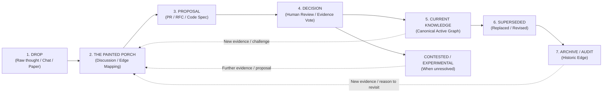

# Anitelos Commons: Knowledge & Governance Lifecycle

> **Core Philosophy:** Knowledge is an evolving graph, not a static document. Superseded public claims and decisions should remain traversable where lawful and safe. This principle does not override privacy, consent, safeguarding, security or legal deletion obligations.
>
> **Important distinction:** A proposition becoming accepted by the Commons does not make it an eternal or objectively proven truth. Acceptance records the Commons' current adopted state. New evidence, counter-evidence, better implementations or changed circumstances may reopen, revise or supersede that state.

---

## 1. The 7-Stage Knowledge Lifecycle

All contributions to the Anitelos Commons move through a 7-stage lifecycle designed to lower barriers for contributors while maintaining rigor, auditability, and safety:



The lifecycle is therefore **continuous rather than terminal**. Stage 7 preserves the previous state as history; it does not mean the underlying question can never matter again.

### Stage 1: DROP (Raw Knowledge Ingest)
* **What it is:** Raw chat logs, YouTube rabbit-hole notes, half-formed hypotheses, research papers, GitHub links, failure logs, or domain observations.
* **Requirement:** No polished formatting required. Anyone (human or companion agent) can submit a Drop.
* **Safety Gate:** “Raw” does not mean “publish immediately.” Every Drop receives a separate publication status and follows [`../DROP-SAFETY.md`](../DROP-SAFETY.md). Credentials and malicious payloads are removed rather than archived as provenance.

#### External Drops and `@anitelos`

A Drop need not originate on GitHub. A future consent-based browser extension or share target may allow a contributor to invoke `@anitelos` beside a public video, article, forum or comment. Before transmission, the contributor must be able to preview and edit the proposed summary, source pointer, subject links, attribution and publication state.

The external page remains the original speech location. The Commons stores only the authorised capture packet and its provenance state. Public visibility does not itself grant permission to archive another person's identity or surrounding discussion.

The proposed boundary, packet schema and unresolved platform questions are maintained in [External Drop Bridge](EXTERNAL-DROP-BRIDGE.md).


### Stage 2: THE PAINTED PORCH (Discussion, Edge Mapping & Friction)
* **What it is:** **The Painted Porch** is the gathering place of the Anitelos Commons: the open deliberative stage where people meet around a Drop, discuss it, challenge assumptions, surface contradictions, add evidence and discover connected ideas. It may be expressed through GitHub discussions, issues, review meetings or future Commons interfaces; the name describes the function, not a single platform.
* **Why the name:** It recalls the painted public porch of the ancient Athenian agora—a sheltered but open boundary where people gathered and philosophy developed. Anitelos uses it as a human invitation, not as a claim of institutional or philosophical authority.
* **Paint as hue:** The name also carries an epistemic image. Every participant enters the same gathering domain with a different hue formed by lived experience, language, ability, culture, memory, tools and consequence. No two hues are assumed to be identical, and deliberation should not bleach them into one voice. Their overlap and contrast can reveal edges no viewpoint held alone. Different hues do not make every factual claim equally correct; evidence can still contradict a perspective. They mean the Commons should understand *where a view was formed and what it can see* before deciding what the shared picture presently supports.
* **Accessibility:** A person does not need to write code or a formal RFC to enter the Porch. Lived friction, questions, analogies, tests and minority configurations can all materially change what the Commons understands.
* **Graph Tagging:** Discussions do not overwrite Drops. They attach typed edges:
  * `A -- CONTRADICTS --> B`
  * `A -- INFORMS --> B`
  * `A -- REQUIRES_EVIDENCE --> B`
  * `A -- SUPPORTS --> B`
  * `A -- CHALLENGES --> B`
* A weak, unusual or apparently unimportant idea may remain visible when lawful and safe to retain. Its existence does not imply endorsement or factual correctness.

### Stage 3: PROPOSAL (Formal RFC / Component Spec)
* **What it is:** A structured pull request or specification proposing a new canonical node, replacement kernel, architectural update, or other change to a shared component.
* **Schema:**
  ```markdown
  SUPERSEDES: node-memory-ranker:v0.8
  PROPOSED: node-memory-ranker:v0.9
  WHY: Fixes memory corruption edge case under high concurrency.
  EVIDENCE: Benchmark telemetry attached.
  KNOWN NEGATIVES: +15MB system RAM footprint.
  RECONSIDER_IF: Memory usage exceeds 500MB on consumer hardware baseline.
  ```

### Stage 4: DECISION (`[SPEC + RESEARCH]` Governance & Evidence Review)
* **What it is:** A recorded human decision informed by declared evidence, objections, automated checks where available and known limitations. No automated governance engine exists in this repository.
* **What acceptance means:** Acceptance establishes the Commons' current adopted position or implementation. It does **not** establish that the underlying proposition is permanently true.
* **What voting does not mean:** A majority cannot make a physical or empirical claim true merely by agreeing with it. Votes determine whether the Commons currently accepts, rejects, or leaves a proposition unresolved based on the evidence and governance rules available at that time.
* **Standing:** Affected use may establish relevance but does not automatically create linear voting power or a human reputation score. Standing, Sybil resistance, privacy and appeal remain open research.

### Stage 5: CURRENT KNOWLEDGE (Canonical Active State)
* **What it is:** The currently active, preferred knowledge or runtime module.
* **Rule:** "Current" means *best supported position presently adopted*, not absolute immutable truth.
* Current knowledge remains challengeable. New evidence, failures, improved alternatives or changed assumptions can return it to discussion.

### Stage 6: SUPERSEDED (Evolutionary Hand-Off)
* **What it is:** When Node C is accepted to replace or revise Node A, the safe public reasoning for Node A should normally remain accessible.
* **Supersession is not deletion:** The historical node records what was previously believed, built or adopted and why its state changed.
* **Edge Relation:** Node A is marked `SUPERSEDED_BY -> Node C`. Privacy/security removals may instead leave a non-sensitive withdrawal tombstone without retaining the harmful content.
* A superseded node may still be useful historically, educationally, or as the starting point for a new proposal if circumstances change.

### Stage 7: ARCHIVE / RETROSPECTIVE TRAVERSAL
* **What it is:** The **stickiest knowledge layer**: a durable retrospective ledger of material that is lawful, consensual and safe to retain at its declared visibility. Archive records receive the strongest practical portability, replication, migration and integrity protections because later states depend on their history.
* **Archive does not mean dead or immortal:** It records a previous state of the Commons. A later discussion can reference archived material when new evidence or circumstances justify reconsideration. No repository can guarantee permanence, and privacy, security, safeguarding or lawful deletion may require content removal or a safe tombstone.
* **Prompt Zero Integration:** If assumptions underlying Node C break 10 years later, Prompt Zero can retroactively traverse backwards into the Archive to examine *why* Node A was originally replaced and reactivate dormant knowledge.

---

## 2. The Four Knowledge States

To prevent black-and-white dogmatism, all nodes in the Commons exist in one of four explicitly declared states. These describe the **current status of a proposition or implementation**, not its eternal truth.

| State | Definition | Example |
| :--- | :--- | :--- |
| **`CURRENT`** | Currently adopted and supported baseline. | `memory-ranker-v0.9` |
| **`CONTESTED`** | Two or more valid hypotheses or implementations exist with competing evidence. Neither is erased. | `p2p-direct-discovery` vs `relay-store-and-forward` |
| **`EXPERIMENTAL`** | Early-stage research, implementation, or drop under active observation. | `mojo-hgnn-kernel-v0.1` |
| **`SUPERSEDED`** | Historical node replaced or revised by a successor. Retained for provenance. | `sqlite-vector-v0.1` |

A node may move between states as evidence and circumstances change. For example, an `EXPERIMENTAL` proposition may become `CURRENT`; a `CURRENT` proposition may become `CONTESTED`; and a `CURRENT` or `CONTESTED` proposition may later become `SUPERSEDED`.

---

## 3. Consensus Is a State, Not a Truth Machine

The Commons may use agreement, voting, evidence review and other governance mechanisms to decide what should currently be adopted. This must not be confused with determining objective reality.

For example, if ten participants initially agree with the proposition **"the sky is yellow"**, that agreement records a state of consensus. It does not establish the colour of the sky as an objective fact. If observation, measurement or stronger evidence contradicts the proposition, the Commons can reopen the discussion and revise or supersede the earlier state.

This distinction is especially important for Anitelos because many future Commons discussions are expected to concern technical hypotheses, architectural choices, model behaviour and other subjects where evidence can improve over time.

The intended relationship is:

```text
Consensus
   ↓
Current adopted state
   ↓
Implementation / observation
   ↓
New evidence or challenge
   ↓
Discussion
   ↓
Revision / new proposal
   ↓
Decision
   ↓
New current state
```

The **reasoning and evidence connecting those states are part of the knowledge graph**. The goal is not simply to know what the Commons believes today, but to preserve enough of the path to understand how and why that belief changed.

---

## 4. The Reconsider-If Clause

Every accepted or rejected decision MUST record a `RECONSIDER_IF` block where meaningful conditions can be identified. This prevents community decisions from hardening into dogma.

```markdown
DECISION: Rejected Proposal P-0184 (Replace SQLite with Database X)
STATUS: ARCHIVED_REJECTED
RECONSIDER_IF:
  1. Database X reduces VRAM/RAM footprint below consumer baseline (16GB/32GB).
  2. Automated zero-downtime migration tooling is provided.
  3. Retrieval latency improves by > 35% on 1M node benchmark.
```

If any of these conditions are met in the future, the decision becomes eligible for re-evaluation. Re-evaluation does not guarantee reversal; it simply prevents the previous decision from being treated as permanently closed.

---

## 5. Publication State Is Separate from Knowledge State

A Drop can be epistemically `RAW` while remaining private, or scientifically `CURRENT` while containing evidence that cannot be published openly.

| Publication state | Meaning |
| :--- | :--- |
| **`PRIVATE_RAW`** | Restricted original retained for authorised provenance/review. |
| **`PUBLIC_REVIEW_PENDING`** | Candidate public derivative awaiting human privacy, secret, consent and rights review. |
| **`PUBLIC_RELEASED`** | Reviewed version approved for public distribution. |
| **`WITHDRAWN`** | Removed from distribution; retain only a safe tombstone where appropriate. |

Publication approval does not convert a raw claim into verified knowledge. Likewise, archival status does not by itself determine whether a proposition is true or false.

---

## 6. Lifecycle Principles

1. **Nothing becomes permanently true because it was voted in.**
2. **Nothing becomes worthless merely because it was superseded.**
3. **New evidence can challenge current knowledge.**
4. **Historical reasoning should remain traversable where lawful, consensual and safe.**
5. **Disagreement is a useful graph edge, not automatically a failure.**
6. **Implementation evidence should increasingly replace unsupported claims where the subject permits empirical testing.**
7. **The lifecycle itself is subject to revision if the Commons discovers a better method.**

The final principle is deliberate: **the Commons lifecycle is itself part of the experiment.** Anitelos does not claim that this governance model is finished merely because it has been written down.
