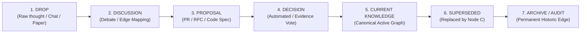

# Anitelos Commons: Knowledge & Governance Lifecycle

> **Core Philosophy:** Knowledge is an evolving graph, not a static document. Superseded public claims and decisions should remain traversable where lawful and safe. This principle does not override privacy, consent, safeguarding, security or legal deletion obligations.

---

## 1. The 7-Stage Knowledge Lifecycle

All contributions to the Anitelos Commons move through a 7-stage lifecycle designed to lower barriers for contributors while maintaining rigor, auditability, and safety:



### Stage 1: DROP (Raw Knowledge Ingest)
* **What it is:** Raw chat logs, YouTube rabbit-hole notes, half-formed hypotheses, research papers, GitHub links, failure logs, or domain observations.
* **Requirement:** No polished formatting required. Anyone (human or companion agent) can submit a Drop.
* **Safety Gate:** “Raw” does not mean “publish immediately.” Every Drop receives a separate publication status and follows [`../DROP-SAFETY.md`](../DROP-SAFETY.md). Credentials and malicious payloads are removed rather than archived as provenance.

### Stage 2: DISCUSSION (Edge Mapping & Friction)
* **What it is:** Collaborative debate where participants surface contradictions, security edge cases, or hardware limits.
* **Graph Tagging:** Discussions do not overwrite Drops. They attach typed edges:
  * `A -- CONTRADICTS --> B`
  * `A -- INFORMS --> B`
  * `A -- REQUIRES_EVIDENCE --> B`

### Stage 3: PROPOSAL (Formal RFC / Component Spec)
* **What it is:** A structured pull request or specification proposing a new canonical node, replacement kernel, or architectural update.
* **Schema:**
  ```markdown
  SUPERSEDES: node-memory-ranker:v0.8
  PROPOSED: node-memory-ranker:v0.9
  WHY: Fixes memory corruption edge case under high concurrency.
  EVIDENCE: Benchmark telemetry attached.
  KNOWN NEGATIVES: +15MB system RAM footprint.
  RECONSIDER_IF: Memory usage exceeds 500MB on consumer hardware baseline.
  ```

### Stage 4: DECISION (`[SPEC + RESEARCH]` Governance & Evidence Review)
* **What it is:** A recorded human decision informed by declared evidence, objections, automated checks where available and known limitations. No automated governance engine exists in this repository.
* **Standing:** Affected use may establish relevance but does not automatically create linear voting power or a human reputation score. Standing, Sybil resistance, privacy and appeal remain open research.

### Stage 5: CURRENT KNOWLEDGE (Canonical Active State)
* **What it is:** The currently active, preferred knowledge or runtime module.
* **Rule:** "Current" means *best supported position presently adopted*, not absolute immutable truth.

### Stage 6: SUPERSEDED (Evolutionary Hand-Off)
* **What it is:** When Node C is accepted to replace Node A, the safe public reasoning for Node A should normally remain accessible.
* **Edge Relation:** Node A is marked `SUPERSEDED_BY -> Node C`. Privacy/security removals may instead leave a non-sensitive withdrawal tombstone without retaining the harmful content.

### Stage 7: ARCHIVE / RETROSPECTIVE TRAVERSAL
* **What it is:** A durable retrospective ledger of material that is lawful, consensual and safe to retain at its declared visibility.
* **Prompt Zero Integration:** If assumptions underlying Node C break 10 years later, Prompt Zero can retroactively traverse backwards into the Archive to examine *why* Node A was originally replaced and reactivate dormant knowledge.

---

## 2. The Four Knowledge States

To prevent black-and-white dogmatism, all nodes in the Commons exist in one of four explicitly declared states:

| State | Definition | Example |
| :--- | :--- | :--- |
| **`CURRENT`** | High-confidence, actively verified baseline. | `memory-ranker-v0.9` |
| **`CONTESTED`** | Two or more valid hypotheses exist with competing evidence. Neither is erased. | `p2p-direct-discovery` vs `relay-store-and-forward` |
| **`EXPERIMENTAL`** | Early-stage research or drop under active observation. | `mojo-hgnn-kernel-v0.1` |
| **`SUPERSEDED`** | Historical node replaced by a higher-performing successor. Retained for provenance. | `sqlite-vector-v0.1` |

---

## 3. The Reconsider-If Clause

Every accepted or rejected decision MUST record a `RECONSIDER_IF` block. This prevents community decisions from hardening into dogma.

```markdown
DECISION: Rejected Proposal P-0184 (Replace SQLite with Database X)
STATUS: ARCHIVED_REJECTED
RECONSIDER_IF:
  1. Database X reduces VRAM/RAM footprint below consumer baseline (16GB/32GB).
  2. Automated zero-downtime migration tooling is provided.
  3. Retrieval latency improves by > 35% on 1M node benchmark.
```

If any of these conditions are met in the future, the decision automatically unlocks for re-evaluation.

---

## 4. Publication State Is Separate from Knowledge State

A Drop can be epistemically `RAW` while remaining private, or scientifically
`CURRENT` while containing evidence that cannot be published openly.

| Publication state | Meaning |
| :--- | :--- |
| **`PRIVATE_RAW`** | Restricted original retained for authorised provenance/review. |
| **`PUBLIC_REVIEW_PENDING`** | Candidate public derivative awaiting human privacy, secret, consent and rights review. |
| **`PUBLIC_RELEASED`** | Reviewed version approved for public distribution. |
| **`WITHDRAWN`** | Removed from distribution; retain only a safe tombstone where appropriate. |

Publication approval does not convert a raw claim into verified knowledge.
