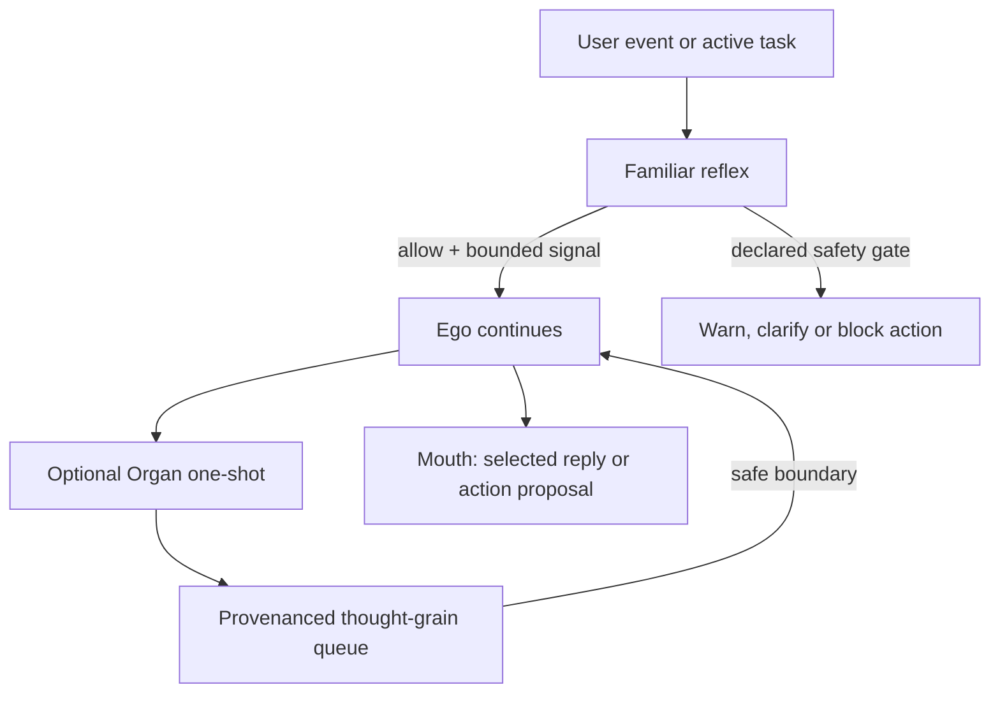

# Ego, Mouth, Organs and Familiars

> **Status:** `[SPEC]` role boundary; `[HYPOTHESIS]` organ intervention mechanism; `[LEGACY-EVIDENCE]` Anikai Familiar implementation awaiting reviewed archival.  
> **Purpose:** Prevent several models, tools and memory systems from being described as one undifferentiated mind.

## The plain distinction

| Role | Plain meaning | Memory/context | May address the user? | Authority |
|---|---|---|---|---|
| **Ego** | The central continuity and decision seat | Protected warm context and authorised continuity | Through the Mouth | Accepts, reshapes or rejects internal proposals |
| **Mouth** | The reply surface: text, voice or rendered interface | No independent identity | Yes | Expresses the Ego's selected response; it does not decide |
| **Organ** | An optional, short-lived reasoning path that examines one aspect of the present problem | Separate one-shot or bounded worker context | No independent reply | Proposes a compact thought grain; never owns the Ego or Mouth |
| **Familiar** | A small operational reflex or utility worker | Isolated, narrow context and task journal | Only through an explicit utility surface | Classifies, guards, routes, scans or reports within a declared capability |

These are engineering roles and metaphors, not evidence that a model possesses human consciousness or biological organs.

## Familiar: reflex before deliberation

A Familiar answers a narrow operational question quickly: *Does this input resemble a prompt attack? Which route fits this turn? What files match this request?* Its result should be structured, inspectable and capability-bounded.

The legacy Anikai application included a Familiar prompt-guard path that scanned input before the main companion inference and could block a turn. That is useful lineage, but remains `[LEGACY-EVIDENCE]` here until its source, model, environment, failure cases and reproduction steps have been reviewed for public release.

A Familiar is therefore not a smaller personality and not the Ego's inner life. It is closer to a reflex, instrument or trained sidekick.

## Organ: another inference, one candidate inner voice

`[HYPOTHESIS]` An Organ performs deeper, conditional reasoning in its own short-lived inference context. It might examine causal consequences, detect task drift, test an argument, compare a remembered pattern or notice a relational tension that the active Ego path missed.

Its **mouth to Ego thought** is not a second user-facing mouth. It is a compact return packet, shaped into a candidate thought grain containing:

- the conclusion or concern;
- the evidence or trigger that produced it;
- confidence and uncertainty where available;
- provenance and the Organ role that produced it;
- an expiry or relevance boundary;
- no raw hidden scratchpad and no undeclared instruction.

The Organ's private working trace is not copied into the Ego, displayed as mystical truth or retained as identity. Only the bounded return packet may be considered.

## What “interrupt” means

An Organ does not rewrite the Ego's live KV state mid-token and does not seize the reply stream. It completes into a queue while the Ego continues. The controller may expose the result at a declared safe boundary:

1. before a consequential tool call;
2. between tool rounds;
3. when a native private-thought segment is open;
4. at the next deliberation step or turn;
5. during an explicitly selected deep-work pause.

The Ego then keeps, edits, combines or rejects the grain. This is a **soft cognitive interruption**: another line of reasoning becomes available without replacing the line that owns continuity.

A **hard gate** is different. A prompt guard, permission boundary or destructive-action policy may pause or block an external action under a rule the user can inspect and configure. An Organ's opinion alone must not silently become such a rule.

## Role invariants

- **One Ego, one owned Mouth, many optional paths.** A hive of inference is not a crowd of identities speaking over one another.
- **Separate contexts by default.** Organs and Familiars do not edit the Ego's live working context directly.
- **Ego has final cognitive say.** A worker result is evidence or advice, not law.
- **Policy gates external power.** Files, shell, network, identity and publication actions remain under explicit capability and consent rules.
- **No raw reasoning inheritance.** Store conclusions, evidence and decisions where authorised—not private scratch or classifier scaffolding.
- **No silent recursive authority.** Organs cannot spawn unbounded Organs, rewrite their own thresholds or promote each other's output without controller limits.
- **Local refusal remains possible.** The user may disable a Familiar, an Organ family, automatic invocation or awareness narration.
- **Failure must be legible.** Timeout, disagreement, malformed output and absent evidence are surfaced as states, not smoothed into false certainty.

## Research questions and tests

The mechanism should earn its place experimentally. Useful comparisons include Ego-only versus Ego-plus-Organ runs on the same recorded task, measuring:

- error discovery and correction;
- task completion and factual quality;
- latency, token use, RAM and VRAM cost;
- persona/goal drift;
- false alarms and unnecessary interruption;
- whether the Ego meaningfully evaluates the grain or merely obeys it;
- whether a poisoned worker packet can redirect tools, memory or speech;
- whether users understand which role acted and can reverse its effects.

An Organ that adds ceremony, latency or covert control without measurable benefit should be removed or superseded. The biological language is allowed to die with the implementation; the enduring requirement is separable, inspectable influence around a protected centre of continuity.

