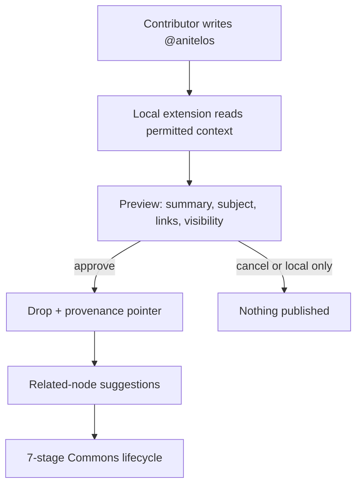

# External Drop Bridge — `@anitelos`

> **Status:** `[SPEC + RESEARCH]` Future browser extension or share-target interface. No deployed collector, platform integration or public database is claimed.  
> **Purpose:** Let discussion begin where people already live online without making GitHub the only doorway into the Painted Porch.

## The idea

A video, article, forum thread, game community or ordinary comment section can contain the beginning of a Commons discussion. A contributor who deliberately types `@anitelos` could ask a local extension to prepare that contribution as a Drop.

The external page remains the place where the statement was made. Anitelos creates a **provenance bridge**, not a silent copy of the surrounding platform.

This bridge is distinct from the proposed
[Personal Curiosity Trail](PERSONAL-CURIOSITY-TRAIL.md). The Curiosity Trail may use
explicitly authorised browser context entirely on the person's machine to build their
private Vault/Wiki graph. `@anitelos` adds a second decision: whether to prepare a bounded
derivative for publication. Neither lane converts browsing history into telemetry.

## Minimum capture packet

The extension should prepare—and show before transmission—a bounded packet:

- canonical page URL and platform/domain;
- public comment or post identifier where available;
- author-approved summary of what they meant;
- selected short excerpt only when rights and platform rules permit;
- subject and candidate claim/question nodes;
- relationships suggested to existing Commons nodes;
- capture time and last-observed time;
- contributor-chosen attribution: named, pseudonymous, anonymous derivative or local-only;
- publication and retention choice;
- source availability state: live, edited, deleted, inaccessible or disputed.

The summary must remain editable. Automatic classification is a suggestion, not the contributor's meaning and not a knowledge verdict.

## What must not happen

- Merely mentioning Anitelos must not silently publish anything.
- The extension must not scrape private pages, other people's identities, surrounding comments or an entire transcript without authority.
- A public comment is not automatic consent to place its author in another permanent database.
- The system must not imply endorsement by the video creator, platform or nearby commenters.
- No hidden advertising profile, cross-site behavioural dossier or sale of personal browsing history.
- No browsing history, inferred interest graph or private Curiosity Trail in functional telemetry.
- No pay-to-rank path may turn advertising money into epistemic weight, voting power or privileged truth status.
- Platform APIs, rate limits, copyright, deletion signals and terms must be checked per connector rather than assumed away.

## From external speech to shared knowledge

The external comment is not itself immediately “Commons knowledge.” It begins as a Drop with a pointer and declared context. Discussion, evidence and work around it create new nodes rather than overwriting the speaker's words.

| Lifecycle moment | Durable object |
|---|---|
| **Drop** | The authorised summary, source pointer, question and provenance |
| **Painted Porch** | Objections, lived consequences, related subjects and evidence edges |
| **Proposal** | A structured position stating what should change and why |
| **Decision** | The adopted, rejected or unresolved result plus minority objections |
| **Current** | The presently supported knowledge or implementation |
| **Superseded** | The explicit relationship from the older state to its replacement |
| **Archive** | The safest durable explanation of what changed, why and under what conditions it may return |

If the original page changes or disappears, the pointer's state changes. An authorised public derivative may remain where lawful and safe; otherwise a tombstone can preserve only that a source existed and influenced a later decision, without retaining withdrawn personal content.

## The archive as the stickiest layer

`[INVARIANT]` The Archive should be the final knowledge layer to disappear because it carries the causal and governance memory required to understand later states. “Sticky” means the system gives it the strongest portability, replication, migration and integrity checks available—not that it promises immortality.

Archive priority should follow this order:

1. decision and supersession relationships;
2. safe explanation of why the state changed;
3. evidence identifiers, scope and uncertainty;
4. reconsideration conditions;
5. authorised source derivatives or pointers;
6. personal/raw material only at its permitted visibility and retention.

Privacy, safeguarding, security and lawful deletion can still require removal. Where appropriate, a non-sensitive withdrawal tombstone preserves graph integrity without preserving the content or identity that had to disappear.

## Recall and personal relevance

When a contributor later encounters a related subject, their local graph may suggest the earlier Drop, its later discussion or the superseding knowledge. This recall must happen locally by default. The public Commons does not need a complete record of what that person watches or reads.

The local graph may also hold questions that were never published. Their dormancy,
resurfacing and deletion remain under the person's authority; a later relationship does
not retroactively turn private browsing into public provenance.

Relatedness may be proposed through typed edges such as:

- `DISCUSSES_SUBJECT`;
- `RESPONDS_TO`;
- `SIMILAR_CLAIM`;
- `CONTRADICTS`;
- `PROVIDES_LIVED_EVIDENCE`;
- `INSPIRED_PROPOSAL`;
- `SUPERSEDED_BY`.

Recommendations should expose *why* two nodes were linked and allow the person to remove a mistaken personal edge.

## Discovery and sustainable visibility

The bridge could create legitimate discovery opportunities: a creator may link a public discussion page, an implementation may sponsor accessible hosting, or a Commons digest may highlight relevant open work. Any future funding model must remain visibly separate from evidence, ranking and governance.

The valuable opportunity is not behavioural advertising. It is helping a useful idea find the people already discussing its domain while preserving the path by which the connection was made.

## Open research questions

- How can explicit intent be distinguished from an ordinary textual mention?
- Who may capture a public statement: its author, the page owner, or a reviewer quoting it under a declared basis?
- How are edits, deletions, account loss and broken links propagated?
- How much surrounding context is necessary to avoid a misleading summary?
- How can spam, brigading, Sybil campaigns and promotional flooding be contained without excluding unfamiliar contributors?
- Which connectors can operate within platform APIs and terms?
- Can portable signed capture receipts establish provenance without exposing identity?
- How are duplicate Drops merged while preserving their independent origins?

Until those questions are implemented and tested, `@anitelos` is an invitation to design a bridge—not a promise that the Commons can safely absorb the whole web.
