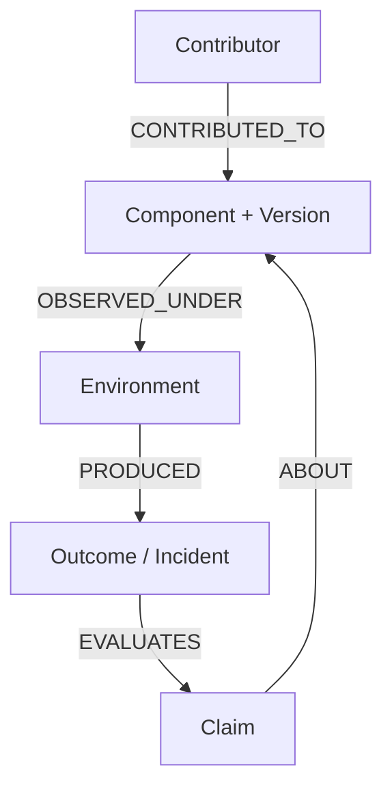

# Anitelos Governance Evidence & Security Specification

> **Status:** `[SPEC]` responsibility model + `[RESEARCH]` governance and security mechanisms.
>
> **Current reality:** This repository contains no automated governance engine,
> capability sandbox, cryptographic object ledger, or verification suite. This
> document defines proposed behaviour and evidence relationships; it does not
> claim enforcement.

---

## 1. Components and Claims, Not Human Scores

Anitelos preserves authorship and responsibility without reducing a person to
a confidence number. Evidence attaches to the exact claim, component, version,
environment and outcome under examination:

The graph may answer:

- Who proposed, reviewed, implemented or tested this exact version?
- Under which hardware, operating system, dependency and workload was it observed?
- Which claim did the outcome support, contradict or leave unresolved?
- What changed after an incident, and which evidence justified that change?

It MUST NOT produce a universal human worth, trustworthiness or social-credit
score. A failed component outcome updates evidence about that component and its
claims, not the dignity or global credibility of its contributor.

---

## 2. Governance Standing Remains Open Research

`[RESEARCH]` Usage can establish that a person is affected by a component, but
execution volume is not equivalent to expertise and must not translate directly
into linear voting power. Any future mechanism must address:

- Sybil manipulation and fabricated telemetry;
- privacy and coercive identity requirements;
- minority hardware and accessibility configurations;
- conflicts of interest and purchased influence;
- expert review without permanent expert castes;
- appeal, conciliation, local reversion and forks.

AI systems may organise evidence, flag contradictions and provide advisory
analysis. Binding governance authority remains human.

Founding provenance grants historical attribution, not perpetual authority.
GitHub is a replaceable hosting organ, not a constitutional root of trust.

---

## 3. Security Invariants and Proposed Enforcement

The distinction between requirement and demonstrated protection is mandatory:

| Layer | Status | Requirement or proposal |
| :--- | :--- | :--- |
| Local sovereignty | `[INVARIANT]` | Compatible telemetry MUST NOT intentionally contain private prompts, vaults or personal memory graphs. |
| Capability declaration | `[SPEC]` | External packages declare filesystem, network, credential, memory and execution requirements. |
| Default denial | `[SPEC]` | Undeclared capabilities are denied; grants are explicit, scoped and revocable. |
| Payload inspection | `[SPEC]` | Users can inspect voluntary diagnostic payloads before submission. |
| Content addressing | `[SPEC]` | Shared objects may use stable hashes and signed manifests for tamper evidence and migration. |
| Sandbox runtime | `[RESEARCH]` | Evaluate WASM and other isolation approaches against escape, side-channel and denial-of-service threats. |
| Enforcement | `[IMPLEMENTED]` | None in this repository. |
| Verification | `[VERIFIED]` | None in this repository. |

### Proposed capability matrix

| Permission scope | Proposed default | Explicit grant |
| :--- | :--- | :--- |
| Filesystem | Denied | Scoped paths only |
| Outbound network | Denied | Named destinations only |
| Credentials | Denied | Scoped broker/proxy only |
| Personal memory graph | Denied | Named indices and purpose |
| Compute/runtime | Bounded | Declared limits |

This matrix is a design target. Until a reference harness and adversarial tests
exist, documentation must say “should deny” or “is specified to deny,” not “the
harness blocks.”

---

## 4. Evidence Required Before Stronger Claims

A mechanism advances from `[SPEC]` to `[IMPLEMENTED]` only when inspectable code
exists in the declared repository location. It advances to `[VERIFIED]` only
when the repository also identifies:

1. the tested version or commit;
2. threat model or benchmark;
3. environment and configuration;
4. test procedure and expected result;
5. retained output or independent reproduction;
6. known limitations and untested paths.

Cryptographic hashes can make changes detectable; they do not by themselves
prove that content is true, safe, complete or permanently available.

---

## 5. Migration and Hosting Independence

`[SPEC]` Shared objects should use stable identifiers, timestamps, provenance
edges and portable manifests so the Commons can be mirrored away from GitHub.
The present repository has not implemented signed manifests, weekly hash chains
or decentralised replication. These remain proposed experiments.
