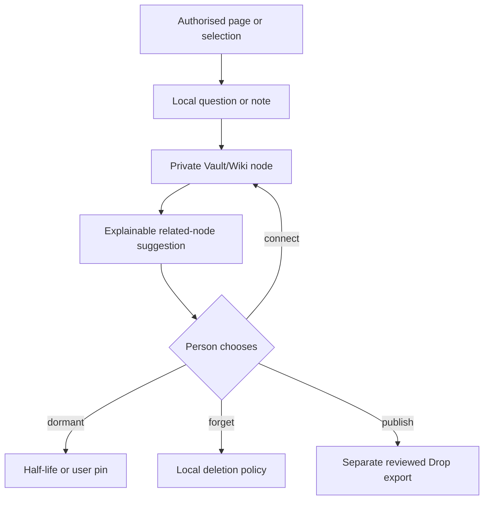

# Personal Curiosity Trail

> **Status:** `[SPEC + RESEARCH]` Local-first browser companion and Vault/Wiki integration. No extension, background collector or public service is implemented in this repository.  
> **Boundary:** This is personal continuity, not telemetry and not automatic Commons publication.

## The missing layer between history and knowledge

Browser history remembers locations. It rarely remembers why a page mattered, what
question it produced, which older curiosity it touched or how the person's view later
changed.

The proposed Personal Curiosity Trail would let an individual turn explicitly authorised
moments into lightweight nodes in their own local SQLite Vault and Cosmic Wiki. A question
as ordinary as:

> Why is the triangle treated as special?

may initially have almost no epistemic weight. It may nevertheless acquire useful edges a
year later through structural engineering, religious art, game geometry or graph theory.
The purpose is not to declare the first intuition profound. It is to give unfinished
curiosity somewhere private to wait for possible meaning.

> **A curiosity does not need to be important when it appears. It only needs somewhere
> safe to wait for meaning.**

## Three stores, three authorities

| Layer | Stores | Authority and default |
|---|---|---|
| **Browser history** | Pages and times already retained by the browser under its settings | Browser/user; Anitelos does not silently duplicate it |
| **Personal Curiosity Trail** | Approved questions, summaries, tentative links and recall state | Local user only; private by default |
| **Painted Porch** | Deliberately contributed Drops and their public lifecycle | Commons rules after an explicit reviewed export |

Access to an existing browser history is not permission to upload, republish or retain it
again. A local extension should request the narrowest permissions possible and let the
person choose between manual capture, selected-site capture and no capture. Incognito or
private browsing must remain excluded unless a future implementation can establish a safe,
explicit and comprehensible exception.

## Proposed local flow

The local system may suggest:

- the page or selected passage that prompted the question;
- candidate subject and domain nodes;
- prior questions that appear related;
- a reason for each proposed relationship;
- an uncertainty score or plain-language uncertainty label; and
- a future reminder or dormancy state chosen by the person.

Automatic summaries and edges remain model suggestions. They do not become the person's
meaning merely because a model generated them.

## Dormancy, return and half-life

A low-connected node may fade from active recall without being immediately destroyed.
Cheap local metadata can retain a bounded pointer or summary while raw page content,
temporary embeddings and duplicate extracts decay sooner. A later authorised encounter
may supply a new edge and return the node to active orbit.

The person must be able to:

- pin a node or freeze the trail;
- see why an old question resurfaced;
- choose **Connect**, **Not related**, **Keep dormant** or **Forget**;
- correct a summary or relationship;
- pause all capture and background processing; and
- apply local retention, export and deletion policies.

This is not a promise of perfect memory. It is a proposed way to reduce repeated
rediscovery without turning a lifelong Vault into a surveillance archive or storage
singularity.

## Telemetry firewall

`[INVARIANT]` Personal curiosity data is not functional telemetry.

Compatible telemetry must not intentionally contain browsing history, URLs, page titles,
selections, questions, notes, inferred interests, personal graph edges, prompts, Vault
contents or the timing pattern of a person's reading. Default-off diagnostic telemetry may
carry only fields allowed by the separate telemetry specification and previewed by the
person.

The fact that a browser already stores information does not make that information safe to
centralise. Local availability and permission to transmit are separate decisions.

## Relationship to `@anitelos`

`@anitelos` is a proposed explicit bridge, not a telemetry tag. A future extension may
recognise an intentional user gesture and prepare a Drop locally. Nothing enters the
Painted Porch until the person previews and approves the exact derivative, provenance
pointer, attribution, visibility and retention choice.

A local-only `@anitelos` note may remain entirely inside the Curiosity Trail. Merely
visiting a page, writing an ordinary comment or forming a suggested edge must not publish
the surrounding history.

## Research questions

- Can useful delayed recall be achieved without continuous browsing observation?
- What is the minimum local context needed to propose a meaningful edge?
- How should models explain relatedness without inventing autobiographical conclusions?
- Which information should decay, compress or remain reconstructible?
- How can extension permissions stay legible as browsers and operating systems change?
- How are local graphs migrated without creating a permanent identity fingerprint?
- What evaluation distinguishes useful resurfacing from interruption and engagement
  optimisation?

The proposed success condition is not more captured data. It is more agency over whether a
small question is forgotten, revisited, corrected or deliberately offered to others.
