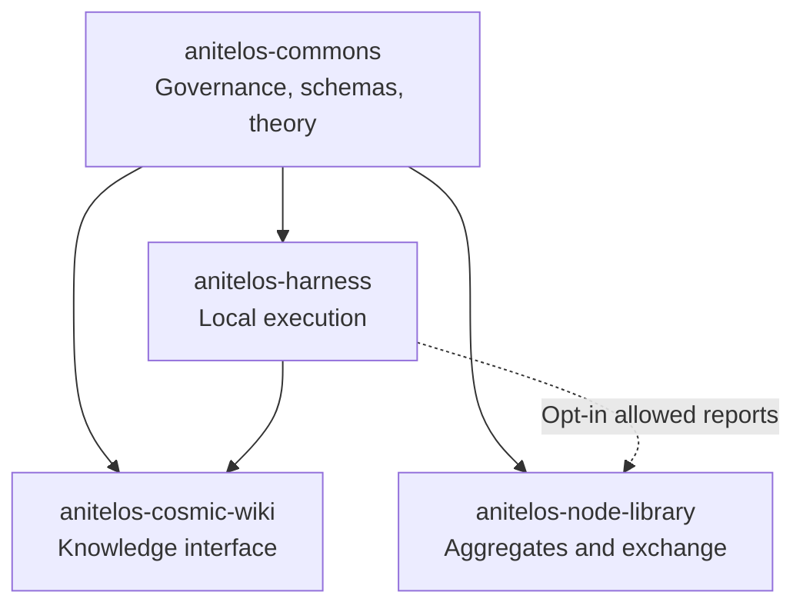

# Anitelos Ecosystem Repository Map

> **Status:** `[SPEC]`. The four ecosystem repositories now exist. The Harness,
> Cosmic Wiki and Node Library repositories are public, spec-first scaffolds;
> repository creation is not evidence that their proposed mechanisms are implemented.

| Repository | Responsibility | Default licence | Data boundary |
| :--- | :--- | :--- | :--- |
| `anitelos-commons` | Governance, Drops, the Painted Porch, proposals, END Theory, shared schemas and ecosystem specifications | CC BY-SA 4.0 for original prose/diagrams; Apache-2.0 for `schemas/` and `protocols/` | No private user knowledge or raw telemetry |
| `anitelos-harness` | Local execution harness, model/organ coordination, update validation, freeze and rollback reference implementation | AGPL-3.0-only | Local data remains local unless the user explicitly releases an allowed report |
| `anitelos-cosmic-wiki` | Inspectable interface for navigating local and public nodes, edges, provenance and knowledge states | AGPL-3.0-only | Must distinguish local/private views from public Commons material |
| `anitelos-node-library` | Specifications and reference code for function-use aggregates, public manifests and graph-edge exchange | AGPL-3.0-only for code; public aggregate data licence undecided | No raw prompts, chats, private knowledge nodes, exact paths or directly identifying event rows |

## What remains inside the Commons

Until scale or implementation creates a real operational boundary:

- `idea-ingest/` remains a Commons proposal/specification area;
- `experiments/` remains a Commons evidence/probe area;
- `docs/` remains the home of cross-ecosystem theory and documentation;
- `schemas/` and `protocols/` use Apache-2.0 to permit independent
  interoperable implementations.

A directory may later become a repository through a recorded Commons proposal.
Repository creation is not evidence that its proposed mechanism is implemented.

## Dependency direction

The Node Library must not become the source of private truth. Public aggregates
may inform Commons discussion; they do not automatically determine votes,
reputation or objective truth.
